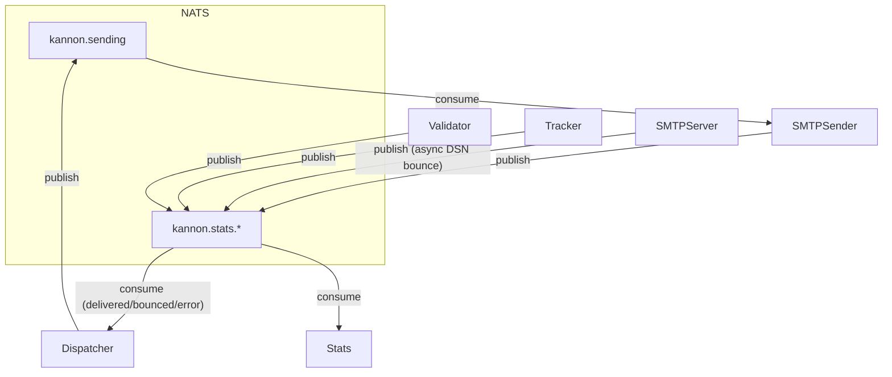
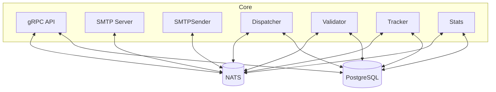

# Kannon Architecture

## Introduction

Kannon is a cloud-native, scalable SMTP mail sender designed for Kubernetes and modern infrastructure. It provides a gRPC API for sending emails, template management, and statistics, and uses NATS for internal messaging between its modular workers and services. Persistence is handled via PostgreSQL.

## Module Overview

### Core Modules

#### `cmd/`

- Application entrypoint and CLI. Starts the components (API, SMTP, smtpsender, dispatcher, etc.) the `services` section of the config file enables.

#### `x/config/`

- Reads the configuration file, resolves the `env://NAME` references in it (`x/config/envref`), and hands each runnable its own section. The `K_` prefix and the `--run-*` flags it replaced are gone. See [ADR 0011](./docs/adr/0011-the-config-file-is-the-contract-and-the-environment-is-referenced-from-it.md) and [ADR 0012](./docs/adr/0012-the-deprecated-configuration-surfaces-are-removed.md).

#### `x/container/`

- Dependency injection container. Manages singletons for DB, NATS, and other shared resources.

#### `internal/db/`

- Database access layer (generated by sqlc). Contains models and queries for all main tables: domains, messages, sending_pool_emails, templates, stats, stats_keys. Hosts the sqlc-backed `Repository` implementations for the `apikeys`, `batch`, `delivery`, `domains`, and `templates` domain packages, translating between sqlc rows and domain entities at the boundary. The `tracking` jsonb column on domains, messages and sending_pool_emails is mapped straight onto `internal/tracking`.`Policy`.

#### `internal/apikeys/`

- Defines the API Key domain entity, `Repository` interface, and `New` / `Load` constructors. Canonical example of the repository pattern documented in `docs/REPOSITORY_GUIDE.md`.

#### `internal/batch/`

- Defines the `Batch` domain entity (the aggregate "one API call to N recipients" unit per `CONTEXT.md`), `Repository` interface, and `New` / `Load` constructors. Wraps the underlying sqlc `Message` row at the repository boundary; the sqlc-backed implementation lives in `internal/db/`.

#### `internal/delivery/`

- Defines the `Delivery` domain entity (the per-recipient transmission of a `Batch` per `CONTEXT.md`), `Repository` interface, `New` / `Load` constructors, and the retry/backoff policy (`NextRetryAt`). Wraps the underlying sqlc `SendingPoolEmail` row at the repository boundary; the sqlc-backed implementation lives in `internal/db/`.

#### `internal/dkim/`

- DKIM key generation and signer used by `internal/domains/` and `internal/envelope/` to produce signed outgoing mail.

#### `internal/envelope/`

- Defines the Envelope domain entity and `envelope.Builder`: the deep module that renders a `Delivery` into an outgoing Envelope. Hides template lookup, per-recipient custom-field rendering, DKIM signing, tracking-pixel injection, click-link rewriting, and custom To/Cc header handling. The Envelope translates to the `EmailToSend` proto at the NATS publish boundary. The Builder reads the Tracking Policy already frozen on the Delivery and never re-resolves it: under `off` it injects no pixel and rewrites no link, so no tracking hostname reaches the message at all; under `pseudonymous` it draws one random identifier per Delivery and hands that same one to the pixel token and to every link token of the Delivery, which is what makes a Recipient's events linkable to each other within the Batch and to nothing outside it; and under `anonymous` — the one Mode whose tokens cannot tell one Recipient of a Batch from another — the minted token is identical for every Recipient and is therefore signed once per Batch instead of once per link per Delivery. Two kinds of href survive a tracked Batch unrewritten: one whose `<a>` tag opts out with `data-no-track`, which the Builder strips before delivery so it never reaches the recipient, and one no redirect could serve — `mailto:`, `tel:`, `sms:`, or an in-page anchor.

#### `internal/pool/`

- Exposes `pool.Claimer`, the deep module that atomically claims `Delivery` entities from the sending pool and transitions them between in-flight states. Hides the enum-flip claim mechanism, the scheduled-time filter, and the exponential backoff window. Initial scheduling is owned by the Mailer API (it persists `Batch` + `Delivery` entities directly via their repositories); the pool package only handles the claim/scheduling primitive over Deliveries.

#### `internal/publisher/`

- Abstraction for publishing messages to NATS (emails to be sent, stats, etc.).

#### `internal/runner/`

- Utility for running background loops/workers with error handling and timing.

#### `internal/smtp/`

- Low-level SMTP sending logic. Handles direct SMTP delivery, error handling, and MX lookups.

#### `internal/statssec/`

- Handles secure generation and verification of tracking tokens for opens/clicks (JWT-based), and manages stats keys. The Tracking Mode that governs an event is a signed claim in the token: Pool rows are deleted on terminal outcomes, so by the time an open arrives there is no Delivery to consult, and signing is what stops a Recipient choosing how much is retained about them. The identity is a signed claim too, and is always an address: the Recipient's own under `identified` and `full`, the Delivery's pseudonym under `pseudonymous`, and the constant `anonymous@track.<domain>` below that (ADR 0006). The mint is the chokepoint where the reservation is enforced — a `pseudonymous` token whose identity does not sit under `track.<domain>` is refused rather than shipped, so no caller can name somebody by forgetting to blank a field first — which makes that subdomain an operator-facing requirement: no real mail may be delivered under `track.<domain>`, since a real mailbox there would collide with the sentinel space. Tokens minted before the sentinels existed carry no identity at all under the Modes that name nobody, and keep verifying until they expire.

#### `internal/templates/`

- Defines the `Template` domain entity, `Repository` interface, and `New` / `Load`
  constructors for the tenant-authored email body. Follows the same pattern as
  `internal/apikeys/` (entity + repo + repospec); the sqlc-backed implementation
  lives in `internal/db/`.

#### `internal/utils/`

- Utility functions for email, NATS, and general helpers.

#### `internal/domains/`

- Defines the SenderDomain entity (the sender-tenant identity per
  `CONTEXT.md`), `Repository` interface, and `New` / `Load` constructors
  for the domain name + DKIM key pair under which Batches are authored.
  Follows the same pattern as `internal/apikeys/` (entity + repo + repospec);
  the sqlc-backed implementation lives in `internal/db/`. The Go type is
  named `Domain` rather than `SenderDomain` for historical reasons; the
  wire/DB-visible field is `domain`, which is what the sanctioned term calls
  it, so no rename is owed there. Carries the Domain's Tracking Policy, which
  acts as the ceiling for every Batch and Recipient sent under it.

#### `internal/values/`

- Holds `DomainName`, the canonical form of a Domain's name: lower-cased, at
  most 254 characters, at least one dot, and free of `/`, `@` and `*`.
  Constructible only through `Parse`, so a value cannot originate from a
  conversion, and the zero value renders a Resource no Anchor covers — a
  programming error therefore fails closed. It is `DomainName` rather than
  `FQDN` because a trailing dot is what marks a name fully qualified and
  `Parse` refuses one. Canonicalisation lives here and never in
  `internal/authz/`: while two case-differing Domains could coexist,
  lower-casing inside an authorization decision would itself be the
  escalation (ADR 0008).

#### `internal/authz/`

- Decides what a request may do, and nothing else: `Can` is a pure function with
  no context, no I/O and no repository, so the whole model is verifiable as a
  table. `Guard` hands every decision it reaches to a `Recorder` carried in the
  context — whose default is the logging one, so a deployment that enables
  nothing behaves exactly as before, and whose signature is unchanged by the
  audit trail existing. A Principal carries Grants, each a Role *name* fixed to an Anchor; a
  Role is a named set of typed rules defined in this package's catalogue rather
  than in the database, so one reviewable diff changes what every credential of
  that Role may do. Authority is the union of a Principal's Grants and nothing
  subtracts from it — there are no deny rules. Also holds Attenuation (narrowing
  a Grant's Anchor) and the `Guard` decorator, which requires the `attribute`
  Action of any request that names who asked and records the operation it was
  named for. See ADR 0008 and ADR 0009, and `CONTEXT.md`
  §Access control.

#### `internal/audit/`

- The register of authorization decisions: the Audit Record value, its `Repository`
  (insert and delete-older-than, and deliberately no read), the JSON it crosses
  NATS as, the audit stream's configuration, and the `authz.Recorder` that
  publishes one Record per decision. Its own package rather than part of
  `internal/authz/`, for the same reason `internal/authzconnect/` is: the package
  holding the decision must not reach a transport. Off unless an operator sets
  `audit.enabled`, and never read back by Kannon — a decision that could consult
  the register describing earlier ones would no longer be a decision about
  authority. See ADR 0010.

#### `internal/authzconnect/`

- Where the authority model meets Connect: reads the admin token off
  `X-Kannon-Admin-Token`, puts the Principal it resolves to into the request's
  context — carrying whatever claim `X-Kannon-Attribution` names, refused as
  `CodeInvalidArgument` if malformed — and maps a refusal onto
  `CodePermissionDenied`. It is a separate
  package so that `internal/authz/` imports no transport at all — two transports
  over one domain must reach the same answer, and the surest way to keep that
  true is that the package holding the decision cannot reach a transport. It
  holds both sides of the header, so a client and the handler that checks it
  cannot come to spell it differently.

#### `internal/admintoken/`

- The credential the Admin API and both Stats APIs authenticate with: one shared
  secret an operator configures, resolving to `admin` on the root — every Action
  including `attribute`, since this is the credential a front-end holds. Kept
  apart from `internal/authz/` because it is authentication rather than
  authority, and apart from the transport because what it confers does not
  depend on how it arrived. See ADR 0009.

#### `internal/tracking/`

- Defines the Tracking Mode / Tracking Policy vocabulary per `CONTEXT.md`: the
  ordered scale of increasing collection (off, anonymous, pseudonymous,
  identified, full), the pair of Modes governing opens and links, the rank
  order, the cascade resolution that collapses the Domain, Batch and Recipient
  statements into the one Policy that governs a Delivery, and the ceiling
  comparison that reports where a stated Policy asks for more than the level
  above allows. Sits below `batch`, `delivery` and `envelope` so all three can
  depend on it without a cycle, and depends on nothing itself — in particular
  not on the protobuf packages. The rank order is plain Go, deliberately not
  the protobuf enum numbers, so a Mode can be inserted mid-scale without
  renumbering the wire. Also owns the identities the Modes that name nobody
  carry: the `track.<domain>` namespace reserved for them, the constant Anonymous
  sentinel inside it, and the 128-bit `crypto/rand` pseudonym, along with the
  namespace test the mint applies. See ADR 0002, ADR 0003 and ADR 0006.

#### `internal/trackingpb/`

- Translates Tracking Policies between the wire enums and the
  `internal/tracking` domain types. The only place that knows both, so that
  every API boundary accepting a Policy refuses the same values — a Mode this
  build does not know, which is a client built against a newer schema. It is
  strict in that direction only: a Mode arriving from inside Kannon is read
  leniently, since an unknown one reads as stating nothing and an unstated Mode
  can only ever restrict.

### Service/Worker Modules (`pkg/`)

#### `pkg/api/`

- gRPC API server. Exposes Admin, Mailer, and Stats APIs for domain, template, mail, and stats management.

#### `pkg/api/adminapi/`

- Implements the Admin API: domain, template and API-key management, including `SetTrackingPolicy`, the deliberate call by which a Domain operator sets the tracking ceiling their Batches are resolved against (`GetDomain` reads it back).

#### `pkg/api/mailapi/`

- Implements the Mailer API: handles SendHTML/SendTemplate requests, validates auth, and enqueues emails. Owns the intake of a Batch, and with it the Tracking Policy cascade: it resolves the Domain, Batch and Recipient statements once, per Recipient, and freezes the concrete result on each Delivery, so a Delivery records the Policy that actually governed it (ADR 0003). A Batch asking for more than its Domain allows fails the call; a single Recipient asking for more is Rejected on its own, with a stable reason returned in `SendRes.rejected_recipients` alongside the accepted and rejected counts.

#### `pkg/api/hzapi/`

- Implements the gRPC health-check (`hz`) endpoint exposed alongside the Admin / Mailer APIs.

#### `pkg/statsapi/`

- Implements the Stats API (`statsv1`, `statsv2`): exposes stats queries.

#### `pkg/hz/`

- Standalone HTTP liveness/readiness server for Kubernetes probes.

#### `pkg/tracker/`

- Handles HTTP endpoints for open/click tracking. Publishes stats to NATS, carrying the Tracking Mode it read from the token's verified claims. That Mode is the single gate on what the request leaves behind: the IP address and user agent are read only under `full`, the Recipient is named only from `identified` upwards, and under `pseudonymous` the event carries the token's pseudonym instead — enough to link one Delivery's events to each other, and nothing more. Under `anonymous` the sentinel is dropped rather than published, so the event names nobody and reaches no stat row.

#### `pkg/dispatcher/`

- Worker that pulls scheduled emails from the pool, builds messages, and publishes them to NATS for sending. Listens for delivery/bounce/error events from NATS and updates the pool accordingly.

#### `pkg/smtpsender/`

- Worker that consumes emails to send from NATS, performs SMTP delivery, and publishes delivery/bounce/error stats back to NATS.
- Acknowledges a message only once the SMTP transaction has returned, so its consumer is given an ack deadline that outlasts one (`sendAckPolicy`), and every send is claimed in the `kannon-sent-envelopes` key/value bucket first, so a redelivery cannot put the same email in a mailbox twice. See [ADR 0004](docs/adr/0004-send-idempotency-guard.md).
- **Never talks to the database.** NATS in, SMTP out, NATS out: the Envelope it consumes, the claim it takes, and the outcome it publishes all live in NATS, and nothing it needs is in PostgreSQL. That is what lets it be deployed on its own, scaled with outbound volume rather than with database capacity, and keep sending while the database is unavailable — so it is a constraint on what may be added here, not a description of what happens to be here. See [ADR 0013](docs/adr/0013-the-sender-never-talks-to-the-database.md), enforced by `TestSenderNeverTalksToTheDatabase`.

#### `pkg/smtp/`

- Runs the SMTP server, accepts incoming SMTP messages, and publishes bounce events to NATS.

#### `pkg/stats/`

- Worker that consumes stats events from NATS and persists them to the database. Two independent consumers read the same `kannon.stats.*` subject: the per-recipient one writes a stat row, and the aggregated one increments the Domain's hourly counters. Under `anonymous` only the second runs — the event moves the counters and leaves no per-recipient row at all. An event that is *not* anonymous yet arrives naming nobody violates that invariant and is logged as an error rather than quietly dropped.

#### `pkg/audit/`

- Worker that consumes `kannon.audit.*` and writes one row per authorization decision, beside an hourly sweep that deletes what is older than `audit.retention`. Refuses to start, with a warning, when `audit.enabled` is unset: nothing publishes then, so there would be nothing to consume. A payload it cannot read is `Term`ed rather than `Nak`ed — a poisoned message that comes straight back is the #396 hot loop — while a database error is `Nak`ed, so a transient failure costs a delay and not a record.

#### `pkg/validator/`

- Worker that validates emails in the pool before scheduling for sending. Publishes accepted/rejected stats to NATS.

## API Key Security

### Storage Model

API keys are stored securely: only a SHA-256 hash and an 8-character prefix are persisted. The plaintext key is returned once at creation time and never stored.

The `api_keys` table contains:

| Column          | Description                                      |
| --------------- | ------------------------------------------------ |
| `id`            | Unique key identifier (prefixed with `key_`)     |
| `key_hash`      | SHA-256 hash of the full plaintext key            |
| `key_prefix`    | First 8 characters for display/identification     |
| `domain`        | Associated sender domain                         |
| `name`          | Human-readable key name                          |
| `is_active`     | Whether the key can be used for authentication    |
| `expires_at`    | Optional expiration timestamp                    |
| `deactivated_at`| Timestamp when the key was deactivated            |
| `created_at`    | Timestamp when the key was created                |

### Hashing

Keys are hashed at the application level using SHA-256 (`internal/apikeys/key.go:HashKey`). The hash is computed once during key creation and stored in `key_hash`. During authentication, the service layer hashes the incoming plaintext key and passes the hash to the repository for lookup.

### Authentication Flow

1. Client sends a request to the Mailer gRPC API with Basic auth credentials (domain + API key)
2. The service layer hashes the plaintext key with `HashKey()`
3. The repository looks up the key by domain and hash
4. The service validates that the key is active and not expired

### Security Measures

- **Timing-attack prevention**: The database lookup is always performed, even for invalid key formats, to avoid leaking whether a key exists
- **Generic error messages**: Authentication failures return the same error regardless of the reason (key not found, inactive, or expired)
- **Key masking**: Only the 8-character prefix is exposed in API responses; the full key and hash are never returned
- **Optional expiration**: Keys can have an expiration date, after which they are no longer valid
- **Irreversible deactivation**: Once deactivated, a key cannot be re-activated

### Key Lifecycle

1. **Generation**: `NewAPIKey()` generates a random key, computes its SHA-256 hash and prefix
2. **Storage**: The hash and prefix are persisted; the plaintext key is returned to the caller once
3. **Authentication**: Incoming keys are hashed by the service and matched against stored hashes
4. **Deactivation**: Keys can be deactivated via the Admin API (irreversible)

## NATS Streams, Topics, and Consumers

Kannon uses NATS JetStream for reliable, decoupled messaging between its modules. The main streams and topics are:

### Streams and Topics

| Stream/Topic           | Description                    | Publishers (Modules) | Consumers (Modules) |
| ---------------------- | ------------------------------ | -------------------- | ------------------- |
| kannon.sending         | Emails to be sent via SMTP     | Dispatcher           | SMTPSender          |
| kannon.stats.accepted  | Email accepted for sending     | Validator            | Stats               |
| kannon.stats.rejected  | Email rejected (invalid, etc.) | Validator            | Stats               |
| kannon.stats.delivered | Email delivered successfully   | SMTPSender           | Stats, Dispatcher   |
| kannon.stats.bounced   | Email bounced, synchronously or by a later DSN. Carries `permanent` (5xx vs 4xx) | SMTPSender, SMTP Server | Stats, Dispatcher |
| kannon.stats.error     | Transient send error (retried) | SMTPSender           | Stats, Dispatcher   |
| kannon.stats.opened    | Email opened (tracking pixel)  | Tracker              | Stats               |
| kannon.stats.clicked   | Link clicked in email          | Tracker              | Stats               |
| kannon.audit.allowed   | An authorization decision that permitted an operation | API | Audit |
| kannon.audit.denied    | An authorization decision that refused one, including a request nothing authenticated. The outcome is in the subject so refusals can be alerted on without querying the table | API | Audit |
| kannon.bounce          | Stream declared in `x/container`, but nothing publishes or consumes it | — | — |

### Example NATS JetStream Configuration

```yaml
streams:
  - name: kannon_sending
    subjects: ["kannon.sending"]
    retention: limits
    max_msgs: 100000
    max_age: 72h
  - name: kannon_stats
    subjects: ["kannon.stats.*"]
    retention: limits
    max_msgs: 100000
    max_age: 168h
  - name: kannon_bounce
    subjects: ["kannon.bounce"]
    retention: limits
    max_msgs: 10000
    max_age: 168h
```

`kannon-audit` is deliberately absent from this list and from `provisionEmbeddedJetStreams`: its configuration lives in exactly one function, `audit.ConfigureStream`, called at startup by both the API and the audit worker so that neither depends on the other's boot order. Its `max_age` is 7 days — a buffer for a worker that is down, kept far below `audit.retention` so there are not two archives with two expiries.

### Module Interactions with NATS

- **Dispatcher**: Publishes to `kannon.sending`, and consumes `kannon.stats.delivered`, `kannon.stats.bounced` and `kannon.stats.error` to advance a Delivery out of `sending`.
- **SMTPSender**: Consumes from `kannon.sending`, publishes to `kannon.stats.delivered`, `kannon.stats.bounced`, etc.
- **Validator**: Publishes to `kannon.stats.accepted` and `kannon.stats.rejected`.
- **Tracker**: Publishes to `kannon.stats.opened` and `kannon.stats.clicked`.
- **Stats**: Consumes all `kannon.stats.*` topics.
- **SMTP Server**: Publishes asynchronous DSN bounces to `kannon.stats.bounced`, the same subject SMTPSender uses for synchronous ones. Both go through `publisher.PublishStat`, which derives the subject from the payload rather than naming it at the call site.

### NATS Messaging Diagram


```mermaid
flowchart TD
    subgraph NATS
        SENDING["kannon.sending"]
        STATS["kannon.stats.*"]
    end
    Dispatcher -- "publish" --> SENDING
    SENDING -- "consume" --> SMTPSender
    SMTPSender -- "publish" --> STATS
    Validator -- "publish" --> STATS
    Tracker -- "publish" --> STATS
    SMTPServer -- "publish (async DSN bounce)" --> STATS
    STATS -- "consume" --> Stats
    STATS -- "consume (delivered/bounced/error)" --> Dispatcher
```

## Architecture Diagram


```mermaid
flowchart TD
    subgraph Core
        API["gRPC API"]
        SMTP["SMTP Server"]
        SMTPSender["SMTPSender"]
        Dispatcher["Dispatcher"]
        Validator["Validator"]
        Tracker["Tracker"]
        Stats["Stats"]
    end
    DB[(PostgreSQL)]
    NATS[(NATS)]
    API <--> DB
    Dispatcher <--> DB
    Validator <--> DB
    Stats <--> DB
    Tracker <--> DB
    API <--> NATS
    SMTPSender <--> NATS
    Dispatcher <--> NATS
    SMTP <--> NATS
    Stats <--> NATS
    Validator <--> NATS
    Tracker <--> NATS
```

## API and NATS Message Flows

### 1. Email Submission (API)

- Client calls the gRPC Mailer API (`SendHTML` or `SendTemplate`).
- API authenticates the domain, processes the template, and enqueues recipients into the sending pool (DB).

### 2. Validation (Validator)

- The Validator worker pulls emails from the pool with status `to_validate`.
- Validates email addresses. If valid, marks as `scheduled` and publishes an `accepted` stat to NATS. If invalid, cleans from pool and publishes a `rejected` stat.

### 3. Dispatching (Dispatcher)

- The Dispatcher pulls `scheduled` emails from the pool, builds the email (DKIM, tracking, etc.), and publishes them to NATS (`kannon.sending`).
- Listens for delivery, bounce, and error events from NATS and updates the pool accordingly.

### 4. Sending (SMTPSender)

- The SMTPSender worker consumes emails from NATS (`kannon.sending`), performs SMTP delivery, and publishes delivery/bounce/error stats to NATS (`kannon.stats.*`).
- It reads and writes nothing in PostgreSQL. Everything the send needs is in the Envelope, and every consequence of it leaves as a stat: the Dispatcher, not the sender, is what turns that stat into a Pool transition ([ADR 0013](docs/adr/0013-the-sender-never-talks-to-the-database.md)).

### 5. SMTP Server

- Accepts incoming SMTP messages (for bounces, etc.), parses them, and publishes bounce events to NATS.

### 6. Tracking (Tracker)

- HTTP endpoints for open/click tracking. When triggered, verifies tokens and publishes open/click stats to NATS.

### 7. Stats Collection

- The Stats worker consumes all stats events from NATS (`kannon.stats.*`) and persists them to the database.

### 8. Admin & Stats APIs

- Admin API: Domain and template management (CRUD, key rotation, etc.).
- Stats API: Query delivery, open, click, and bounce statistics.

---

This architecture enables scalable, decoupled email delivery and analytics, with clear separation of concerns and robust observability via stats and events.
