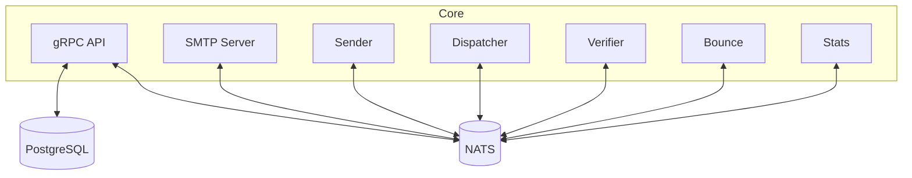

# Kannon Architecture

## Introduction

Kannon is a cloud-native, scalable SMTP mail sender designed for Kubernetes and modern infrastructure. It provides a gRPC API for sending emails, template management, and statistics, and uses NATS for internal messaging between its modular workers and services. Persistence is handled via PostgreSQL.

## Module Overview

### Core Modules

#### `cmd/`

- Application entrypoint and CLI. Handles configuration, service startup, and orchestrates which components (API, SMTP, sender, dispatcher, etc.) are run.

#### `internal/x/container/`

- Dependency injection container. Manages singletons for DB, NATS, and other shared resources.

#### `internal/db/`

- Database access layer (generated by sqlc). Contains models and queries for all main tables: domains, messages, sending_pool_emails, templates, stats, stats_keys.

#### `internal/mailbuilder/`

- Responsible for building and signing emails (DKIM), rendering templates, and preparing messages for sending. Adds tracking links and pixels.

#### `internal/pool/`

- Manages the sending pool (queue) of emails. Handles scheduling, rescheduling, and cleaning up emails in the pool.

#### `internal/publisher/`

- Abstraction for publishing messages to NATS (emails to be sent, stats, etc.).

#### `internal/runner/`

- Utility for running background loops/workers with error handling and timing.

#### `internal/smtp/`

- Low-level SMTP sending logic. Handles direct SMTP delivery, error handling, and MX lookups.

#### `internal/statssec/`

- Handles secure generation and verification of tracking tokens for opens/clicks (JWT-based), and manages stats keys.

#### `internal/templates/`

- Manages email templates: CRUD, transient templates, and template lookup.

#### `internal/utils/`

- Utility functions for email, NATS, and general helpers.

#### `internal/domains/`

- Manages sender domains and DKIM keys.

### Service/Worker Modules (`pkg/`)

#### `pkg/api/`

- gRPC API server. Exposes Admin, Mailer, and Stats APIs for domain, template, mail, and stats management.

#### `pkg/api/adminapi/`

- Implements the Admin API: domain and template management.

#### `pkg/api/mailapi/`

- Implements the Mailer API: handles SendHTML/SendTemplate requests, validates auth, and enqueues emails.

#### `pkg/api/statsapi/statsv1/`

- Implements the Stats API: exposes stats queries.

#### `pkg/bump/`

- Handles HTTP endpoints for open/click tracking. Publishes stats to NATS.

#### `pkg/dispatcher/`

- Worker that pulls scheduled emails from the pool, builds messages, and publishes them to NATS for sending. Listens for delivery/bounce/error events from NATS and updates the pool accordingly.

#### `pkg/sender/`

- Worker that consumes emails to send from NATS, performs SMTP delivery, and publishes delivery/bounce/error stats back to NATS.

#### `pkg/smtp/`

- Runs the SMTP server, accepts incoming SMTP messages, and publishes bounce events to NATS.

#### `pkg/stats/`

- Worker that consumes stats events from NATS and persists them to the database.

#### `pkg/validator/`

- Worker that validates emails in the pool before scheduling for sending. Publishes accepted/rejected stats to NATS.

## Architecture Diagram

## API and NATS Message Flows

### 1. Email Submission (API)

- Client calls the gRPC Mailer API (`SendHTML` or `SendTemplate`).
- API authenticates the domain, processes the template, and enqueues recipients into the sending pool (DB).

### 2. Validation (Verifier)

- The Verifier worker pulls emails from the pool with status `to_validate`.
- Validates email addresses. If valid, marks as `scheduled` and publishes an `accepted` stat to NATS. If invalid, cleans from pool and publishes a `rejected` stat.

### 3. Dispatching (Dispatcher)

- The Dispatcher pulls `scheduled` emails from the pool, builds the email (DKIM, tracking, etc.), and publishes them to NATS (`kannon.sending`).
- Listens for delivery, bounce, and error events from NATS and updates the pool accordingly.

### 4. Sending (Sender)

- The Sender worker consumes emails from NATS (`kannon.sending`), performs SMTP delivery, and publishes delivery/bounce/error stats to NATS (`kannon.stats.*`).

### 5. SMTP Server

- Accepts incoming SMTP messages (for bounces, etc.), parses them, and publishes bounce events to NATS.

### 6. Tracking (Bump)

- HTTP endpoints for open/click tracking. When triggered, verifies tokens and publishes open/click stats to NATS.

### 7. Stats Collection

- The Stats worker consumes all stats events from NATS (`kannon.stats.*`) and persists them to the database.

### 8. Admin & Stats APIs

- Admin API: Domain and template management (CRUD, key rotation, etc.).
- Stats API: Query delivery, open, click, and bounce statistics.

---

This architecture enables scalable, decoupled email delivery and analytics, with clear separation of concerns and robust observability via stats and events.
