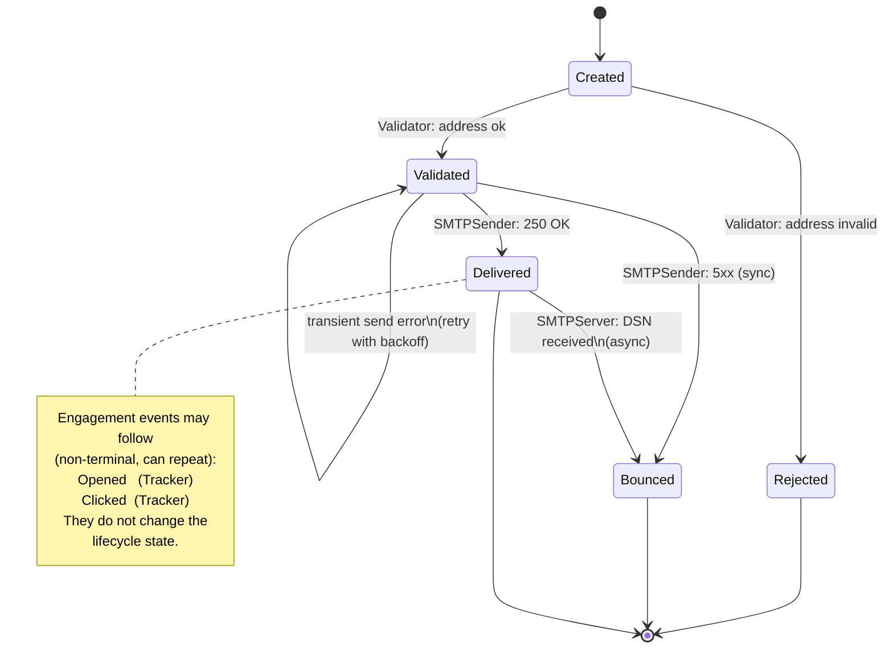

# Kannon

Cloud-native transactional SMTP sender. Accepts a single API call describing one templated email to many recipients, and is responsible for personalising, delivering, and reporting on each recipient outcome.

## Language

**Batch**:
The unit of intent created by one Mailer API call: one Sender, one subject, one body or template, and N Recipients, optionally scheduled. Identified by `message_id` (legacy field name).
_Avoid_: Campaign, Mailing, Send, Message (in the aggregate sense)

**Recipient**:
The input description of one target for a Batch: an email address plus per-recipient template fields. A Recipient is *input data* — it becomes a Delivery once the Batch is created.
_Avoid_: To, Addressee, Target (when meaning the Recipient)

**Domain**:
The sender-tenant entity. Identified by a fully qualified domain name (FQDN), holds a DKIM keypair, and owns API Keys, Templates, Batches, and Deliveries. In this codebase "Domain" *always* means this entity — the DDD sense of "domain" is not used. The string identifier is referred to as the **FQDN** (today the field is also named `domain`; rename to `fqdn` is queued — see `docs/REFACTORING.md` §4).
_Avoid_: Tenant, Account, SenderIdentity (these are not used in Kannon's vocabulary)

**Template**:
A stored email body keyed by `template_id`, owned by a Domain. Has a **lifetime** that distinguishes how it was created and how it is managed.

- **Transient Template** — auto-created from the inline HTML of a `SendHTML` API call so the Dispatcher can render it later. Not surfaced in Admin listings. Enables a future "split a million-recipient Batch across multiple API calls without re-uploading the body" use case: the first call inlines the HTML (creating a Transient Template), subsequent calls can reference it by ID via `SendTemplate`.
- **Persistent Template** — explicitly created and curated via the Admin API. Appears in `GetTemplates`, can be updated and reused across many Batches.

_Avoid_: treating `template_type` as a source-format axis (HTML/MJML/etc.); that is a separate, currently-not-modelled concern.

**Delivery**:
One Recipient's slot in a Batch. Persistent record carrying lifecycle state, retry count, scheduled time, and per-recipient personalisation fields. The unit Validator and Dispatcher operate on.
_Avoid_: SendingPoolEmail, PoolEmail, Email (when meaning the row, not the address)

**Envelope**:
A built, DKIM-signed, transmission-ready message for one Delivery. Transient — exists in flight on the `kannon.sending` NATS topic, handed from Dispatcher to the Sender worker. Immutable once built.
_Avoid_: EmailToSend, OutboundMail

### Actors

**Mailer API**:
gRPC handler that accepts `SendHTML` / `SendTemplate` calls and creates a Batch with N Deliveries.

**Validator**:
Worker that pulls Deliveries with status `to_validate`, validates the recipient address, and either schedules them or rejects them.
_Avoid_: Verifier

**Dispatcher**:
Worker that pulls scheduled Deliveries, builds Envelopes, and publishes them to NATS for transmission. Also consumes delivery / bounce / error events and updates Delivery state.

**SMTPSender**:
Worker that consumes Envelopes from NATS, performs the outbound SMTP transmission, and publishes delivery / bounce / error stats. Pairs symmetrically with **SMTPServer**.
_Avoid_: Sender (collides with the `Sender` proto type)

**SMTPServer**:
Inbound SMTP listener. Receives bounce / DSN traffic from remote mail systems and publishes bounce events to NATS.

**Stats**:
Worker that consumes all `kannon.stats.*` events and persists them.

**Tracker**:
HTTP server that handles open and click tracking. Verifies signed tokens, redirects clicks to the original URL, serves the tracking pixel, and emits Opened / Clicked events to NATS.
_Avoid_: Bump (legacy package name, removed under PRD #322; the `bump:` config key remains as a deprecated alias and will be removed in a future major version)

### Outcomes (per Delivery)

These are the domain-visible events that may attach to a Delivery over its lifetime. Each is recorded as a stat row (`stats` table) and emitted on the corresponding `kannon.stats.*` NATS topic. Multiple events accumulate per Delivery — the "current state" is inferred from the latest non-engagement event.

**Validated**:
The Validator accepted the recipient address. Emitted once per Delivery on the happy path. Predecessor of any transmission outcome.
_Avoid_: Accepted (legacy proto/db name; renamed in the refactor — see `docs/REFACTORING.md` §2)

**Rejected**:
The Validator refused the recipient address. Terminal — the Delivery is deleted from the Pool. Carries a `reason`.

**Delivered**:
The remote MX accepted the SMTP handoff (e.g. responded `250 OK`). Does **not** mean the message reached an inbox — only that the next hop accepted responsibility. A subsequent asynchronous DSN can still bounce a Delivered Delivery.

**Bounced**:
Permanent delivery failure. Two sources:
- *Synchronous*: the remote MX rejected with a 5xx during transmission (emitted by **SMTPSender**).
- *Asynchronous*: a DSN was received later (emitted by **SMTPServer**, possibly long after **Delivered**).

Carries `permanent`, `code`, `msg`. The `permanent` flag is true in both cases today; transient failures are not Bounces (see Errored).

**Opened**:
A tracking pixel was retrieved. Engagement event — non-terminal, may fire multiple times per Delivery.

**Clicked**:
A tracked link was followed. Engagement event — non-terminal, may fire multiple times per Delivery. Carries `url`.

**Errored** (internal):
Transient transmission failure. Triggers a reschedule with backoff (`send_attempts_cnt++`). Today emitted as a stat (`kannon.stats.error`) and consumed by the Dispatcher. Flagged for demotion to internal logging in the refactor — it isn't an outcome of the Delivery, just a retry signal. Not part of the shared language for outcomes.
_Avoid_: as a domain term — Errored is plumbing, not an outcome.

### Delivery outcome state machine

Notes:
- **Created** is implicit — there is no `created` stat event today. The Delivery row simply exists in the Pool from the moment **Mailer API** writes it.
- The `Validated → Validated` self-loop (transient error) is internal mechanics: the **Pool** row is rescheduled, not re-stated. Surfaced here only to explain why Errored exists at all.
- A Delivery may legitimately reach `Delivered` and *then* `Bounced` — e.g. accepted by a relay that later rejects asynchronously. The latest event wins.
- Per-Batch stats are aggregations of per-Delivery outcomes (counts in the `aggregated_stats` table).

### Internal mechanics (not domain)

**Pool**:
The internal work-in-progress board for in-flight Deliveries (PostgreSQL table `sending_pool_emails`). Rows are **deleted** on terminal outcomes — successful or failed — rather than flagged. Pool state values are implementation detail and intentionally NOT part of the shared language; see `docs/REFACTORING.md` §1 and `internal/db/pool.go`.
_Avoid_: Queue, SendingPool (when discussed as a domain concept — it isn't one)

## Relationships

- A **Domain** owns many **Templates**, **API Keys**, **Batches**, and (transitively) **Deliveries**
- A **Batch** contains one or more **Deliveries** (one per Recipient)
- A **Delivery** is built into exactly one **Envelope** when dispatched
- An **Envelope** belongs to exactly one **Delivery**
- The **Dispatcher** produces **Envelopes**; the **SMTPSender** consumes them
- A **Template** is referenced by 0..N **Batches**
- A **Recipient** (input) becomes one **Delivery** (persistent record) when a **Batch** is created

## Example dialogue

> **Dev:** "If a `SendHTML` call has 100 Recipients, do we make 100 Batches?"
> **Domain expert:** "No — one Batch with 100 Deliveries. Each Recipient becomes one Delivery. The Mailer API writes them all into the Pool as a single Batch."

> **Dev:** "What's the difference between Delivered and Validated?"
> **Domain expert:** "Validated is the Validator saying the address is well-formed. Delivered is the remote MX accepting our SMTP handoff. A Delivery has to be Validated first, then Delivered (or Bounced) later. And Delivered doesn't mean inbox — only that the next hop took responsibility. We can still get an async Bounce from a DSN after that."

> **Dev:** "When do I emit a Bounced stat vs an Errored signal?"
> **Domain expert:** "Bounced is permanent — the remote rejected the message and won't accept it. Errored is transient plumbing — the connection dropped, we retry with backoff. Errored isn't really an outcome; it's a retry signal. Don't show it to users."

## Flagged ambiguities

- "Message" was used in code (`Message` table, `message_id`) for the aggregate (A). Resolved: the aggregate is now **Batch**. The legacy `message_id` field name is retained on the wire for compatibility but the concept it identifies is a **Batch**.
- "Batch" connotes a processing job and reads oddly at cardinality 1 ("a batch of one"). Accepted as a deliberate trade-off — chosen for its accuracy about the multi-recipient shape and to keep "Message" free for the SMTP/RFC sense.
- "Envelope" puns on the SMTP envelope (`MAIL FROM`/`RCPT TO`). Accepted: the **Envelope** here *is* the SMTP envelope plus its payload, so the pun is informative rather than misleading.
- The proto type `Sender{email, alias}` is misaligned with RFC 5322, where `Sender` ≠ `From` (Sender = submitter, From = author). The proto is closer to `From`. Renaming is wire-breaking and deferred; flagged for a future major version.
- `ARCHITECTURE.md` previously used both "Validator" and "Verifier" for the same module. Resolved under PRD #322: **Validator** is canonical and "Verifier" has been removed from the docs and Go code; `run-verifier` / `K_RUN_VERIFIER` remain as deprecated CLI/env aliases that log a warning at startup, until removed in a future major version.
