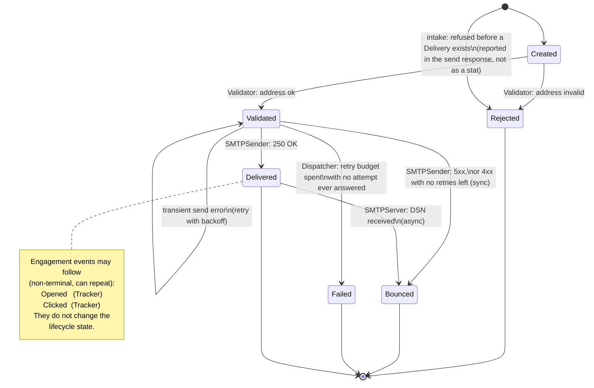

# Kannon

Cloud-native transactional SMTP sender. Accepts a single API call describing one templated email to many recipients, and is responsible for personalising, delivering, and reporting on each recipient outcome.

## Language

**Batch**:
The unit of intent created by one Mailer API call: one Sender, one subject, one body or template, and N Recipients, optionally scheduled. Identified by `message_id` (legacy field name).
_Avoid_: Campaign, Mailing, Send, Message (in the aggregate sense)

**Recipient**:
The input description of one target for a Batch: an email address plus per-recipient template fields. A Recipient is *input data* — it becomes a Delivery once the Batch is created.
_Avoid_: To, Addressee, Target (when meaning the Recipient)

**Domain**:
The sender-tenant entity. Identified by a **domain name**, holds a DKIM keypair, and owns API Keys, Templates, Batches, and Deliveries. In this codebase "Domain" *always* means this entity — the DDD sense of "domain" is not used. The domain name is canonical: lower-cased, at least two labels, and carrying none of the punctuation an authorization path is built from (`internal/values`). Its typed form is `values.DomainName`; the wire and DB field is `domain`, which agrees with the term, so the rename of that field this entry used to queue no longer has a reason.
_Avoid_: Tenant, Account, SenderIdentity (these are not used in Kannon's vocabulary); FQDN — the trailing dot is what marks a name fully qualified and `values.Parse` refuses one, so the abbreviation would assert a form the type does not accept

**Template**:
A stored email body keyed by `template_id`, owned by a Domain. Has a **lifetime** that distinguishes how it was created and how it is managed.

- **Transient Template** — auto-created from the inline HTML of a `SendHTML` API call so the Dispatcher can render it later. Not surfaced in Admin listings. Enables a future "split a million-recipient Batch across multiple API calls without re-uploading the body" use case: the first call inlines the HTML (creating a Transient Template), subsequent calls can reference it by ID via `SendTemplate`.
- **Persistent Template** — explicitly created and curated via the Admin API. Appears in `GetTemplates`, can be updated and reused across many Batches.

_Avoid_: treating `template_type` as a source-format axis (HTML/MJML/etc.); that is a separate, currently-not-modelled concern.

**Delivery**:
One Recipient's slot in a Batch. Persistent record carrying lifecycle state, retry count, scheduled time, and per-recipient personalisation fields. The unit Validator and Dispatcher operate on.
_Avoid_: SendingPoolEmail, PoolEmail, Email (when meaning the row, not the address)

**Retry Budget**:
How long Kannon keeps trying to get a Delivery out, counted from the moment its Batch asked for it to be sent. A Delivery is retried for as long as the next retry would still fall inside the window, and always gets at least one attempt however late it is offered one.

The allowance is a span of time rather than a number of attempts, so it is indifferent to *what* consumed the attempts — a remote MX answering transiently, an Envelope that could not be built or handed on, a send whose outcome never came back. Every Delivery gets the same span, and Kannon's own faults cannot eat into a sender's chances of delivery. Running out is what makes a Delivery terminal without an answer: **Bounced** if the attempt that ran out the clock was answered, **Failed** if none ever was.
_Avoid_: Retry Count, Max Retries, Attempts — the attempt tally exists, but it shapes the backoff curve rather than deciding when to stop

**Envelope**:
A built, DKIM-signed, transmission-ready message for one Delivery. Transient — exists in flight on the `kannon.sending` NATS topic, handed from Dispatcher to the Sender worker. Immutable once built.
_Avoid_: EmailToSend, OutboundMail

**Tracking Mode**:
How much a single engagement channel may be observed, on an **ordered** scale of increasing collection:

- **Off** — not observed at all.
- **Anonymous** — counted in aggregate only. Nothing is retained that could isolate one Recipient from another: the event moves the Domain's aggregate counters and leaves no per-Delivery record, and the token it arrives on names no Recipient and is therefore the *same* token for every Recipient of a Batch — per Batch for the pixel, and per Batch-and-URL pair for a link. A link whose URL is itself personalised with custom fields is a different URL per Recipient by construction, so it cannot share a token; nothing per-Recipient is retained either way, but such a message is distinguishable to whoever handles it in transit.
- **Pseudonymous** — events are linkable to each other within a single Batch via an identifier that is regenerated for every Batch and never reused across Batches, but carry no Recipient identity. The identifier takes the form `<rand>@track.<sending-domain>`: a random local part under a subdomain reserved for tracking identities, stored nowhere and derived from nothing, so no one — Kannon included — can link it back to the Recipient.
- **Identified** — attributed to the Recipient.
- **Full** — attributed, plus the IP address and user agent of the request.

Only Off and Anonymous retain no personal data; the three upper rungs do, and the Domain is responsible for having a lawful basis before selecting them. Because the scale is ordered, two Modes can be compared and the more restrictive of the two taken.
_Avoid_: Tracking Level (collides with the Domain/Batch/Recipient level), Tracking Type, Tracking Flag. "Axis" names the opens/links dimension of a Policy, never the Domain/Batch/Recipient one, which is a **level**.

**Tracking Policy**:
A pair of Tracking Modes — one governing opens, one governing links — expressing what may be observed about a Delivery. Stated independently at Domain, Batch and Recipient level, where a lower level may only **restrict** what the level above allows, never widen it: the effective Policy is the most restrictive of the three, and a level that states nothing imposes no restriction of its own. The Domain always states one. Resolved once per Delivery when the Batch is created and frozen there, so a Delivery records the Policy that actually governed it rather than whatever is configured now.

A Policy states what *may* be observed, not what must be: the authored HTML may keep a single link out of click tracking with a `data-no-track` attribute on its `<a>` tag. That is an authoring decision taken inside an already-resolved Policy — it narrows what that Delivery's Policy allows and can never widen it — not a fourth level of the cascade, and it is stripped from the delivered HTML.
_Avoid_: Tracking Settings, Tracking Config, Consent (a Policy conveys a consent decision taken elsewhere; it is not itself the consent, and Kannon never stores consent)

**One-Click Unsubscribe**:
The **sender's own** unsubscribe endpoint, stated once per Batch as an `https` URL template and personalised per Delivery, carried in the `List-Unsubscribe` and `List-Unsubscribe-Post` headers (RFC 8058). Kannon signs it, so that a receiver can trust the destination was part of the authenticated message, but does not own it, never calls it, and retains nothing about who used it: leaving is not engagement, and to the Tracker a Delivery that ends in an unsubscribe is indistinguishable from one that does not.

Stated at Batch level only — there is no Domain default and no Recipient override. A Domain default would stamp an unsubscribe on the password resets and receipts that are this sender's core traffic, offering a recipient something the sender cannot honour; and a Recipient override would add nothing, since personalising the template from the Recipient's fields is already what makes the endpoint per-Recipient. This is a deliberate asymmetry with **Tracking Policy**, which does cascade: a Policy expresses a permission that is meaningful to narrow by degrees, while this is an operational instruction that is meaningful only where the intent of a single Batch lives.
_Avoid_: Unsubscribe Link (suggests something to click, and therefore something trackable), Unsubscribe List / Suppression List (Kannon keeps neither), Opt-out (a consent notion, which under ADR 0002 Kannon does not store)

### Access control

**Principal**:
Who is making a request, as resolved by whatever authenticated it. A value object rather than a stored record: each authentication method populates one in its own way — an API Key by looking it up, a token by reading its claims — so what a Principal *is* never depends on how it arrived. Carries an identifier naming the credential it came from and the **Grants** that say what it may do. A Principal *describes* authority; it does not decide. Something else asks it.
_Avoid_: User, Identity, Account (Kannon knows of no persons; the nearest thing to one reaches it as an **Attribution**, which is not a Principal), Subject, Caller

**Action**:
One verb a Principal may be allowed to perform on a **Resource**. The vocabulary is small and closed — `create`, `read`, `list`, `update`, `delete`, `attribute` — and deliberately says nothing about *what* is being acted on, since the Resource already carries that: giving Kannon a new kind of thing to manage adds no new Actions, and a Grant that makes no sense cannot be written down. Sending mail is therefore `create` on a Domain's Batches rather than a verb of its own, which is what the language already says a send *is*. `list` is separate from `read` because a path and everything beneath it can only be held together: without the distinction, knowing *which* things exist could never be granted apart from inspecting them, and enumeration discloses something different from inspection.
_Avoid_: Permission (ambiguous between the verb, the verb-and-Resource pair a request needs, and the Grant that satisfies it — say Action or Grant), Scope, Capability, `send` / `manage` / any verb naming what it acts on

**Resource**:
What a request acts on, named by a hierarchical path: `domains`, `domains/example.com`, `domains/example.com/templates/abc`. Authority over a path extends to everything beneath it, so authority over `domains/example.com` reaches that Domain's Templates and Batches without naming them. Two things are deliberately inexpressible: holding a path *without* what lies under it, and taking anything back — authority is only ever added, never subtracted.
_Avoid_: Scope (says nothing about the tree shape and collides with OAuth's meaning), Object, Path (too generic once several kinds of path exist)

**Role**:
A named set of rules, each pairing Actions with the *kind* of thing they act on — "create and update on Templates, read on API Keys" — stated relative to the Anchor of the Grant that places it. Defined in code rather than stored, so that what a Role means is settled in one place at review time and a change to it takes effect everywhere at once — including for credentials issued long before. A Role says what may be done and on what kinds of things, never *where*: the where is the Grant's Anchor. A Role whose rules name no kind at all is pure shape — "everything beneath the Anchor" — and is meaningful anywhere; a Role whose rules name kinds fits only the kind of Anchor they were written against.
_Avoid_: Group, Policy (collides with Tracking Policy), Permission Set, ClusterRole (a Kubernetes role is scoped by where it is *defined*; a Kannon Role is scoped only by the Anchor of its Grant)

**Grant**:
A Role fixed to an Anchor — *this* Role, *anchored here*. A Principal carries a set of Grants and its authority is their union. Reach and power stay independent: the Anchor decides how far the Role's rules reach and adds nothing to what they can do, so the same Role on a wider Anchor reaches further without gaining a single Action.
_Avoid_: Assignment, Binding, RoleBinding, Rule (a rule is part of a Role; a Grant places rules, it does not state them)

**Anchor**:
The Resource a Grant fixes its Role to — where the Role's rules attach. A Grant is issued on exactly two kinds of Anchor: the root, written `*`, meaning the whole tree; or a Domain — one (`domains/example.com`) or every (`domains/*`). Nothing in between is grantable: the `domains` collection and paths inside a Domain are refused rather than left to mean something other than what they say. Attenuation may later narrow an Anchor to any concrete path the Role's rules still fit.
_Avoid_: Scope (collides with OAuth), Namespace (the Kubernetes analogue — Kannon's name for that place is the Domain)

**Attenuation**:
Narrowing a Principal's Grants to smaller Anchors — the same identity with less reach. Authority can only shrink, because the narrowed set is the *intersection* of what was asked for with what was already held: asking for more than one holds yields less rather than more, so widening is not a mistake one can make. No Action is needed to do it, since giving up power one already holds is always safe. An attenuated Principal keeps the identifier of the credential it came from, so narrowing changes what may be done and never who did it.
_Avoid_: Impersonation (in Kubernetes and GCP that means *acquiring another principal's* authority, which is precisely what Attenuation cannot do), Delegation, Sudo

**Attribution**:
A claim accompanying a Principal that names who asked, on the far side of a caller Kannon cannot see into — a front-end that has its own people and hands their requests on. Unverifiable in principle, since those people exist only in that system, so an Attribution is **recorded and never consulted**: it can no more widen what a Principal may do than it can be checked. Making one requires the `attribute` Action, because writing an arbitrary name into the record of who did what is itself a power and not every credential should hold it. The Principal that actually called is recorded whether or not an Attribution accompanies it, so the record never leaves the question of who acted unanswered.
_Avoid_: Actor, Subject (RFC 8693 uses both for exactly this shape, and its `actor` is the *calling* party — the opposite of how the word reads), Impersonation, On-Behalf-Of, User; and "attribute" as a *noun* (that is a field, and the A of ABAC — as a verb it is the Action, as a noun the word is always Attribution)

**Admin Token**:
The credential the Admin API and both Stats APIs authenticate with: one secret an operator configures, resolving to a Principal that is `admin` on the root. It names the credential and not a person — the record of an administrative act can say a holder of the token did it and never which holder — which is what makes it the interim answer it is, alongside a revocation that is a restart. What replaces it is per-operator credentials carrying Grants of their own, which the model already expresses (ADR 0009).
_Avoid_: Root Token, Master Key, Superuser; API Key (that is the Domain-bound credential the Mailer API authenticates, and it resolves to `sender` on one Domain)

### Actors

**Mailer API**:
gRPC handler that accepts `SendHTML` / `SendTemplate` calls and creates a Batch with N Deliveries.

**Validator**:
Worker that pulls Deliveries with status `to_validate`, validates the recipient address, and either schedules them or rejects them.
_Avoid_: Verifier

**Dispatcher**:
Worker that pulls scheduled Deliveries, builds Envelopes, and publishes them to NATS for transmission. Also consumes delivery / bounce / error events and updates Delivery state.

**SMTPSender**:
Worker that consumes Envelopes from NATS, performs the outbound SMTP transmission, and publishes delivery / bounce / error stats. Pairs symmetrically with **SMTPServer**.
_Avoid_: Sender (collides with the `Sender` proto type)

**SMTPServer**:
Inbound SMTP listener. Receives bounce / DSN traffic from remote mail systems and publishes bounce events to NATS.

**Stats**:
Worker that consumes all `kannon.stats.*` events and persists them.

**Tracker**:
HTTP server that handles open and click tracking. Verifies signed tokens, redirects clicks to the original URL, serves the tracking pixel, and emits Opened / Clicked events to NATS.
_Avoid_: Bump (legacy package name, removed under PRD #322; the `bump:` config key remains as a deprecated alias and will be removed in a future major version)

### Outcomes (per Delivery)

These are the domain-visible events that may attach to a Delivery over its lifetime. Each is emitted on the corresponding `kannon.stats.*` NATS topic and recorded as a stat row (`stats` table), with two exceptions: an engagement event under Anonymous, which by definition attaches to no Recipient and so only increments the Domain's aggregate counters; and a Recipient Rejected at intake, which has no Delivery to attach to and is reported to the caller in the send response instead. Multiple events accumulate per Delivery — the "current state" is inferred from the latest non-engagement event.

**Validated**:
The Validator accepted the recipient address. Emitted once per Delivery on the happy path. Predecessor of any transmission outcome.
_Avoid_: Accepted (legacy proto/db name; renamed in the refactor — see `docs/REFACTORING.md` §2)

**Rejected**:
The Recipient was refused and no Delivery will be attempted. Terminal — the Delivery is deleted from the Pool, or never created. Carries a `reason`. Two causes, which differ in where they are observable:

- The **Validator** refused the recipient address. The Delivery existed, so this is emitted as a stat and appears in the state machine below.
- The Recipient was refused **at intake**, for asking a Tracking Mode above what its Domain allows or for stating one this build will not act on. This happens before a Delivery is created, so there is nothing to emit a stat against: it is reported to the caller in the send response, alongside the accepted and rejected counts.

**Delivered**:
The remote MX accepted the SMTP handoff (e.g. responded `250 OK`). Does **not** mean the message reached an inbox — only that the next hop accepted responsibility. A subsequent asynchronous DSN can still bounce a Delivered Delivery.

**Bounced**:
Terminal delivery failure — no further attempt will be made. Two sources, both emitted on `kannon.stats.bounced`:
- *Synchronous*: the remote MX rejected during transmission (emitted by **SMTPSender**), either with a 5xx or with a 4xx once the retry budget ran out.
- *Asynchronous*: a DSN was received later (emitted by **SMTPServer**, possibly long after **Delivered**).

Carries `permanent`, `code`, `msg`. `permanent` qualifies *why* the Delivery is terminal, by SMTP reply class: 5xx means the address itself is dead and worth writing off, 4xx means someone gave up after retrying — us on the synchronous path, the remote MTA on the asynchronous one. Both sources classify it the same way. A transient failure that still has retries left is not a Bounce at all (see Errored).

A Bounce always carries a reply code, because a Bounce is a remote mail system having spoken. A Delivery that ends without one ever having spoken is **Failed**, not Bounced.

Terminality is a property of the event, not of the Pool row: by the time an asynchronous DSN arrives the Delivery has usually been Delivered and dropped from the Pool already, so the event lands as a stat with no row left to transition.

_Known gap_: the SMTPServer reads only the DSN's `Diagnostic-Code` and treats every DSN as a failure. An RFC 3464 `Action: delayed` — the remote MTA is still retrying, so no outcome has been reached — is therefore recorded as a Bounce and inflates the bounce rate. Tracked separately from #376.

**Failed**:
Terminal failure in which no attempt at this Delivery ever produced an outcome. Carries a `reason` and — unlike **Bounced** — no reply code, because there is none to carry: no remote mail system ever spoke. Emitted by the **Dispatcher** when a Delivery exhausts its retry budget without a single attempt having been answered, whether because no Envelope could be built for it (its Batch's Template is gone, its Domain's DKIM key is unusable) or because none of its Envelopes could be handed on.

Failed states what Kannon knows, which is less than what happened: an Envelope may have been transmitted and its outcome lost on the way back, and such a Delivery is Failed too. Kannon claims only that it never learned of an outcome — never that the recipient did not receive the mail.

Distinct from **Rejected**, which is a judgement Kannon passed on the Recipient *before* attempting anything. Failed is the absence of an answer *after* attempting, repeatedly.
_Avoid_: Errored (that is the transient retry signal), Dropped, Abandoned, Expired

**Opened**:
A tracking pixel was retrieved. Engagement event — non-terminal, may fire multiple times per Delivery. Only occurs when the Delivery's Tracking Policy allows opens. Carries the Tracking Mode that governed it, and carries `ip` / `user_agent` only under Full — under Identified it names the Recipient and nothing more, and under Anonymous it names nobody at all and leaves no stat row. The Mode reaches the Tracker as a signed claim in the token, not from a database lookup: the Delivery may already be gone, and a Recipient must not be able to choose how much is retained about them. An event that is *not* Anonymous yet arrives naming nobody is a bug, and is logged as an error rather than quietly discarded.

**Clicked**:
A tracked link was followed. Engagement event — non-terminal, may fire multiple times per Delivery. Carries `url`. Subject to the Delivery's Tracking Policy on the same terms as Opened.

**Errored** (internal):
Transient transmission failure. Triggers a reschedule with backoff (`send_attempts_cnt++`). Today emitted as a stat (`kannon.stats.error`) and consumed by the Dispatcher. Flagged for demotion to internal logging in the refactor — it isn't an outcome of the Delivery, just a retry signal. Not part of the shared language for outcomes.
_Avoid_: as a domain term — Errored is plumbing, not an outcome.

### Delivery outcome state machine

```mermaid
stateDiagram-v2
    [*] --> Created
    Created --> Validated: Validator: address ok
    Created --> Rejected: Validator: address invalid
    [*] --> Rejected: intake: refused before a Delivery exists\n(reported in the send response, not as a stat)
    Validated --> Delivered: SMTPSender: 250 OK
    Validated --> Bounced: SMTPSender: 5xx,\nor 4xx with no retries left (sync)
    Validated --> Validated: transient send error\n(retry with backoff)
    Validated --> Failed: Dispatcher: retry budget spent\nwith no attempt ever answered
    Delivered --> Bounced: SMTPServer: DSN received\n(async)
    Rejected --> [*]
    Bounced --> [*]
    Failed --> [*]
    Delivered --> [*]

    note right of Delivered
      Engagement events may follow
      (non-terminal, can repeat):
        Opened   (Tracker)
        Clicked  (Tracker)
      They do not change the
      lifecycle state.
    end note
```

Notes:
- **Created** is implicit — there is no `created` stat event today. The Delivery row simply exists in the Pool from the moment **Mailer API** writes it.
- The `Validated → Validated` self-loop (transient error) is internal mechanics: the **Pool** row is rescheduled, not re-stated. Surfaced here only to explain why Errored exists at all.
- A Delivery may legitimately reach `Delivered` and *then* `Bounced` — e.g. accepted by a relay that later rejects asynchronously. The latest event wins.
- Per-Batch stats are aggregations of per-Delivery outcomes (counts in the `aggregated_stats` table).

### Internal mechanics (not domain)

**Pool**:
The internal work-in-progress board for in-flight Deliveries (PostgreSQL table `sending_pool_emails`). Rows are **deleted** on terminal outcomes — successful or failed — rather than flagged. Pool state values are implementation detail and intentionally NOT part of the shared language; see `docs/REFACTORING.md` §1 and `internal/db/pool.go`.
_Avoid_: Queue, SendingPool (when discussed as a domain concept — it isn't one)

**Reclaim**:
Handing a Delivery back to the Pool because the **claim** a worker held on it outlived the work. A worker takes a claim by moving the row into one of the two in-flight Pool statuses — the kind of claim is a `delivery.InFlight` — and a Delivery is **stranded** when nothing is coming to move it out again: the worker died holding the claim, or the outcome of the work never came back. Nobody else can move it, because the only exits from an in-flight status belong to the worker that took the claim. So each claiming worker reclaims its own status on a timer, past a threshold of its own — the Dispatcher what it claimed for dispatch, the Validator what it claimed for validation (ADR 0004, ADR 0007).

A reclaim recovers and never terminates. It asserts nothing about what happened to the Delivery in the meantime, because it cannot know, so it emits no outcome and the sender is told nothing: only the **Retry Budget** ends a Delivery.
_Avoid_: Reaper / Reaping, Sweep / Sweeper, Requeue, Janitor, Unstick. *Stranded* names the condition a reclaim recovers from and *claim* the thing it takes back — neither is a name for the recovery itself.

## Relationships

- A **Domain** owns many **Templates**, **API Keys**, **Batches**, and (transitively) **Deliveries**
- A **Batch** contains one or more **Deliveries** (one per Recipient)
- A **Delivery** is built into exactly one **Envelope** when dispatched
- An **Envelope** belongs to exactly one **Delivery**
- The **Dispatcher** produces **Envelopes**; the **SMTPSender** consumes them
- A **Template** is referenced by 0..N **Batches**
- A **Recipient** (input) becomes one **Delivery** (persistent record) when a **Batch** is created

## Example dialogue

> **Dev:** "If a `SendHTML` call has 100 Recipients, do we make 100 Batches?"
> **Domain expert:** "No — one Batch with 100 Deliveries. Each Recipient becomes one Delivery. The Mailer API writes them all into the Pool as a single Batch."

> **Dev:** "What's the difference between Delivered and Validated?"
> **Domain expert:** "Validated is the Validator saying the address is well-formed. Delivered is the remote MX accepting our SMTP handoff. A Delivery has to be Validated first, then Delivered (or Bounced) later. And Delivered doesn't mean inbox — only that the next hop took responsibility. We can still get an async Bounce from a DSN after that."

> **Dev:** "When do I emit a Bounced stat vs an Errored signal?"
> **Domain expert:** "Bounced is permanent — the remote rejected the message and won't accept it. Errored is transient plumbing — the connection dropped, we retry with backoff. Errored isn't really an outcome; it's a retry signal. Don't show it to users."

## Flagged ambiguities

- "Message" was used in code (`Message` table, `message_id`) for the aggregate (A). Resolved: the aggregate is now **Batch**. The legacy `message_id` field name is retained on the wire for compatibility but the concept it identifies is a **Batch**.
- "Batch" connotes a processing job and reads oddly at cardinality 1 ("a batch of one"). Accepted as a deliberate trade-off — chosen for its accuracy about the multi-recipient shape and to keep "Message" free for the SMTP/RFC sense.
- "Envelope" puns on the SMTP envelope (`MAIL FROM`/`RCPT TO`). Accepted: the **Envelope** here *is* the SMTP envelope plus its payload, so the pun is informative rather than misleading.
- The proto type `Sender{email, alias}` is misaligned with RFC 5322, where `Sender` ≠ `From` (Sender = submitter, From = author). The proto is closer to `From`. Renaming is wire-breaking and deferred; flagged for a future major version.
- `ARCHITECTURE.md` previously used both "Validator" and "Verifier" for the same module. Resolved under PRD #322: **Validator** is canonical and "Verifier" has been removed from the docs and Go code; `run-verifier` / `K_RUN_VERIFIER` remain as deprecated CLI/env aliases that log a warning at startup, until removed in a future major version.
