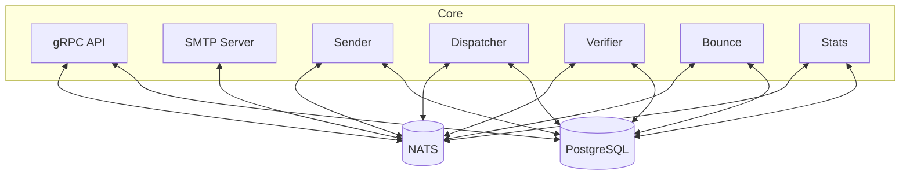

# Kannon 💥

[](https://github.com/gyozatech/kannon/actions/workflows/ci.yaml)


A **Cloud Native SMTP mail sender** for Kubernetes and modern infrastructure.

> [!NOTE]
> Due to limitations of AWS, GCP, etc. on port 25, this project will not work on cloud providers that block port 25.

---

## Table of Contents

- [Features](#features)
- [Architecture](#architecture)
- [Quickstart](#quickstart)
- [Configuration](#configuration)
- [Database Schema](#database-schema)
- [API Overview](#api-overview)
- [Deployment](#deployment)
- [Domain & DNS Setup](#domain--dns-setup)
- [Sending Mail](#sending-mail)
- [Testing & Demo Mode](#testing--demo-mode)
- [Development & Contributing](#development--contributing)
- [License](#license)

---

## Features

- Cloud-native, scalable SMTP mail sending
- gRPC API for sending HTML and templated emails
- DKIM and SPF support for deliverability
- Attachments support (JSONB in DB)
- Custom fields for emails (JSONB in DB)
- Statistics and analytics (DB + gRPC API)
- Template management (CRUD via API)
- Kubernetes-ready deployment
- Postgres-backed persistence

**Planned:**

- Multi-node sending
- Advanced analytics dashboard

## Architecture

Kannon is composed of several microservices and workers:

- **API**: gRPC server for mail, template, and domain management
- **SMTP**: Handles SMTP protocol and relays mail
- **Sender**: Sends emails from the queue
- **Dispatcher**: Manages the sending pool and delivery
- **Verifier**: Validates emails before sending
- **Bounce**: Handles bounces
- **Stats**: Collects and stores delivery statistics

All components can be enabled/disabled via CLI flags or config.

> **See [`ARCHITECTURE.md`](./ARCHITECTURE.md) for a full breakdown of modules, NATS streams, topics, consumers, and message flows.**



## Quickstart

### Prerequisites

- Go 1.25.5+
- Docker (optional, for containerized deployment)
- PostgreSQL database
- NATS server (for internal messaging)

### Local Run (for development)

```sh
git clone https://github.com/kannon-email/kannon.git
cd kannon
go build -o kannon .
./kannon --run-api --run-smtp --run-sender --run-dispatcher --config ./config.yaml
```

### Docker Compose

See [`examples/docker-compose/`](examples/docker-compose/) for ready-to-use files.

```sh
docker-compose -f examples/docker-compose/docker-compose.yaml up
```

- Edit `examples/docker-compose/kannon.yaml` to configure your environment.

### Makefile Targets

- `make test` — Run all tests
- `make generate` — Generate DB and proto code
- `make lint` — Run linters

## Configuration

Kannon can be configured via YAML file, environment variables, or CLI flags. Precedence: CLI > Env > YAML.

**Main config options:**

| Key / Env Var                                   | Type     | Default        | Description                            |
| ----------------------------------------------- | -------- | -------------- | -------------------------------------- |
| `database_url` / `K_DATABASE_URL`               | string   | (required)     | PostgreSQL connection string           |
| `nats_url` / `K_NATS_URL`                       | string   | (required)     | NATS server URL for internal messaging |
| `debug` / `K_DEBUG`                             | bool     | false          | Enable debug logging                   |
| `api.port` / `K_API_PORT`                       | int      | 50051          | gRPC API port                          |
| `sender.hostname` / `K_SENDER_HOSTNAME`         | string   | (required)     | Hostname for outgoing mail             |
| `sender.max_jobs` / `K_SENDER_MAX_JOBS`         | int      | 10             | Max parallel sending jobs              |
| `sender.demo_sender` / `K_SENDER_DEMO_SENDER`   | bool     | false          | Enable demo sender mode for testing    |
| `smtp.address` / `K_SMTP_ADDRESS`               | string   | :25            | SMTP server listen address             |
| `smtp.domain` / `K_SMTP_DOMAIN`                 | string   | localhost      | SMTP server domain                     |
| `smtp.read_timeout` / `K_SMTP_READ_TIMEOUT`     | duration | 10s            | SMTP read timeout                      |
| `smtp.write_timeout` / `K_SMTP_WRITE_TIMEOUT`   | duration | 10s            | SMTP write timeout                     |
| `smtp.max_payload` / `K_SMTP_MAX_PAYLOAD`       | size     | 1024kb         | Max SMTP message size                  |
| `smtp.max_recipients` / `K_SMTP_MAX_RECIPIENTS` | int      | 50             | Max recipients per SMTP message        |
| `run-api` / `K_RUN_API`                         | bool     | false          | Enable API server                      |
| `run-smtp` / `K_RUN_SMTP`                       | bool     | false          | Enable SMTP server                     |
| `run-sender` / `K_RUN_SENDER`                   | bool     | false          | Enable sender worker                   |
| `run-dispatcher` / `K_RUN_DISPATCHER`           | bool     | false          | Enable dispatcher worker               |
| `run-verifier` / `K_RUN_VERIFIER`               | bool     | false          | Enable verifier worker                 |
| `run-bounce` / `K_RUN_BOUNCE`                   | bool     | false          | Enable bounce worker                   |
| `run-stats` / `K_RUN_STATS`                     | bool     | false          | Enable stats worker                    |
| `config`                                        | string   | ~/.kannon.yaml | Path to config file                    |

- See [`examples/docker-compose/kannon.yaml`](examples/docker-compose/kannon.yaml) for a full example.

## Database Schema

Kannon requires a PostgreSQL database. Main tables:

- **domains**: Registered sender domains, DKIM keys
- **messages**: Outgoing messages, subject, sender, template, attachments
- **sending_pool_emails**: Email queue, status, scheduling, custom fields
- **templates**: Email templates, type, metadata
- **stats**: Delivery and open/click statistics
- **stats_keys**: Public/private keys for stats security

See [`db/migrations/`](./db/migrations/) for full schema and migrations.

## API Overview

Kannon exposes a gRPC API for sending mail, managing domains/templates, and retrieving stats.

### Services & Methods

- **Mailer API** ([proto](./proto/kannon/mailer/apiv1/mailerapiv1.proto))
  - `SendHTML`: Send a raw HTML email
  - `SendTemplate`: Send an email using a stored template
- **Admin API** ([proto](./proto/kannon/admin/apiv1/adminapiv1.proto))
  - `GetDomains`, `GetDomain`, `CreateDomain`, `RegenerateDomainKey`
  - `CreateTemplate`, `UpdateTemplate`, `DeleteTemplate`, `GetTemplate`, `GetTemplates`
- **Stats API** ([proto](./proto/kannon/stats/apiv1/statsapiv1.proto))
  - `GetStats`, `GetStatsAggregated`

### Authentication

All gRPC APIs use Basic Auth with your domain and API key:

```
token = base64(<your domain>:<your domain key>)
```

Pass this in the `Authorization` metadata for gRPC calls:

```json
{
  "Authorization": "Basic <your token>"
}
```

### Example: SendHTML Request

```json
{
  "sender": {
    "email": "no-reply@yourdomain.com",
    "alias": "Your Name"
  },
  "recipients": ["user@example.com"],
  "subject": "Test",
  "html": "<h1>Hello</h1><p>This is a test.</p>",
  "attachments": [
    { "filename": "file.txt", "content": "base64-encoded-content" }
  ],
  "fields": { "custom": "value" }
}
```

See the [proto files](./proto/kannon/) for all fields and options.

## Deployment

### Kubernetes

- See [`k8s/deployment.yaml`](k8s/deployment.yaml) for a production-ready manifest.
- Configure your environment via a mounted YAML file or environment variables.

### Docker Compose

- See [`examples/docker-compose/`](examples/docker-compose/) for local or test deployments.

## Domain & DNS Setup

To send mail, you must register a sender domain and configure DNS:

1. Register a domain via the Admin API
2. Set up DNS records:
   - **A record**: `<SENDER_NAME>` → your server IP
   - **Reverse DNS**: your server IP → `<SENDER_NAME>`
   - **SPF TXT**: `<SENDER_NAME>` → `v=spf1 ip4:<YOUR SENDER IP> -all`
   - **DKIM TXT**: `smtp._domainkey.<YOUR_DOMAIN>` → `k=rsa; p=<YOUR DKIM KEY HERE>`

## Sending Mail

- Use the gRPC API (`SendHTML` or `SendTemplate`) with Basic Auth as above.
- See the [proto file](./proto/kannon/mailer/apiv1/mailerapiv1.proto) for all fields and options.

## Testing & Demo Mode

Kannon includes a **demo sender mode** for testing and development without actually sending emails. This is particularly useful for:

- **Development environments** where you don't want to send real emails
- **Testing email templates** and content without affecting deliverability
- **CI/CD pipelines** where you need to verify email functionality
- **Local development** without SMTP server setup

### Enabling Demo Mode

Set `sender.demo_sender: true` in your configuration:

```yaml
sender:
  hostname: kannon.example.com
  max_jobs: 10
  demo_sender: true # Enable demo sender mode
```

Or via environment variable:

```bash
export K_SENDER_DEMO_SENDER=true
```

### Demo Sender Behavior

When demo mode is enabled:

- **Emails are not actually sent** - they're processed through the pipeline but not delivered
- **Statistics are still collected** - you can track delivery attempts and errors.
- **Error simulation** - emails containing "error" in the recipient address will simulate delivery failures
- **Full pipeline testing** - all components (API, dispatcher, sender, stats) work normally
- **Template processing** - HTML templates and custom fields are processed correctly

This mode mocks the SMTP client and does not actually send emails.

**IMPROVEMENTS:**

- mock opens, clicks, etc.
- mock bounce, spam, etc.

### Example: Testing with Demo Mode

```bash
# Start Kannon with demo sender enabled
./kannon --run-api --run-sender --run-dispatcher \
  --sender-demo-sender \
  --sender-hostname test.example.com \
  --config ./config.yaml

# Send test emails via API
# Emails will be processed but not actually sent
# Statistics will be collected normally
```

This makes it easy to test your email integration without setting up SMTP servers or worrying about deliverability during development.

## Development & Contributing

We welcome contributions! Please:

- Use [feature request](.github/ISSUE_TEMPLATE/feature_request.md) and [bug report](.github/ISSUE_TEMPLATE/bug_report.md) templates for issues
- Follow the [pull request template](.github/PULL_REQUEST_TEMPLATE.md)
- See the [Apache 2.0 License](./LICENSE)
- **Read our [CONTRIBUTING.md](./CONTRIBUTING.md) for guidelines, code style, and the full contribution process.**

### Local Development

- Build: `go build -o kannon .`
- Test: `make test` or `go test ./...`
- Generate code: `make generate`
- Lint: `make lint`

### Testing

- Unit and integration tests are in `internal/`, `pkg/`, and run with `go test ./...`
- Some tests use Docker to spin up a test Postgres instance
- **E2E tests** include comprehensive email sending pipeline testing with demo sender mode

---

## Local Testing for Integrations Development

For developers building integrations with Kannon, we provide a complete local testing environment using Docker Compose with demo sender mode. This allows you to test the entire email pipeline without actually sending emails or requiring SMTP server setup.

### Quick Start with Docker Compose

The simplest way to get started is using the provided Docker Compose configuration:

```bash
cd examples/docker-compose/
docker-compose up
```

This will start:

- **PostgreSQL database** with automatic migrations
- **NATS server** for internal messaging
- **Kannon server** with all components enabled and **demo sender mode activated**

The API will be available at `localhost:50051` (gRPC).

### Demo Sender Mode Benefits

When using the docker-compose setup, demo sender mode is automatically enabled (`demo_sender: true` in `kannon.yaml`), which means:

- ✅ **Complete pipeline testing** - All API endpoints, template processing, and statistics work normally
- ✅ **No real emails sent** - Safe for development and testing environments
- ✅ **Statistics collection** - Track delivery attempts, errors, and metrics
- ✅ **Error simulation** - Recipients containing "error" will simulate delivery failures
- ✅ **Template processing** - HTML templates, custom fields, and attachments work correctly
- ✅ **Authentication testing** - Full gRPC API authentication flow

### Configuration

The demo environment uses the configuration in `examples/docker-compose/kannon.yaml`:

```yaml
sender:
  hostname: kannon.ludusrusso.dev
  max_jobs: 100
  demo_sender: true # Mock SMTP sending

# All components enabled for full testing
run-smtp: true
run-bounce: true
run-dispatcher: true
run-verifier: true
run-sender: true
run-api: true
run-stats: true
```

### Testing Your Integration

1. **Start the environment:**

   ```bash
   cd examples/docker-compose/
   docker-compose up -d
   ```

2. **Create a test domain** (using grpcurl or your gRPC client):

   ```bash
   # Register a domain for testing
   grpcurl -plaintext -d '{"domain":"test.example.com"}' \
     localhost:50051 kannon.admin.apiv1.AdminApiV1Service/CreateDomain
   ```

3. **Send test emails** via the API:

   ```bash
   # Send HTML email (will be processed but not actually sent)
   grpcurl -plaintext \
     -H "Authorization: Basic $(echo -n 'test.example.com:your-domain-key' | base64)" \
     -d '{"sender":{"email":"test@test.example.com","alias":"Test"},"recipients":["user@example.com"],"subject":"Test Email","html":"<h1>Hello World</h1>"}' \
     localhost:50051 kannon.mailer.apiv1.MailerApiV1Service/SendHTML
   ```

4. **Check statistics:**
   ```bash
   # View delivery stats (will show processed emails)
   grpcurl -plaintext \
     -H "Authorization: Basic $(echo -n 'test.example.com:your-domain-key' | base64)" \
     localhost:50051 kannon.stats.apiv1.StatsApiV1Service/GetStats
   ```

### Integration Development Workflow

1. **Develop against the local API** - Use `localhost:50051` as your Kannon endpoint
2. **Test email templates** - Use `SendTemplate` API with your template designs
3. **Verify statistics** - Check that your integration correctly handles delivery stats
4. **Test error scenarios** - Send emails to recipients containing "error" to simulate failures
5. **Validate attachments** - Test file attachments and custom fields functionality

### Customizing the Environment

To modify the demo environment:

1. **Edit `examples/docker-compose/kannon.yaml`** for Kannon configuration
2. **Edit `examples/docker-compose/docker-compose.yaml`** for infrastructure changes
3. **Restart the environment:** `docker-compose down && docker-compose up`

### Production Transition

When ready for production, simply change `demo_sender: false` in your configuration and provide real SMTP credentials. Your integration code remains unchanged.

## License

Kannon is licensed under the Apache 2.0 License. See [LICENSE](./LICENSE) for details.
