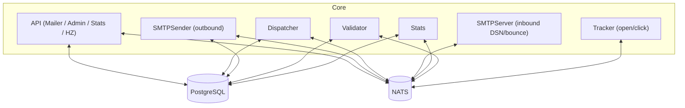

# Kannon 💥

[](https://github.com/kannon-email/kannon/actions/workflows/ci.yaml)


A **Cloud Native SMTP mail sender** for Kubernetes and modern infrastructure.

> [!NOTE]
> Due to limitations of AWS, GCP, etc. on port 25, this project will not work on cloud providers that block port 25.

---

## Table of Contents

- [Features](#features)
- [Architecture](#architecture)
- [Quickstart](#quickstart)
- [Configuration](#configuration)
- [Database Schema](#database-schema)
- [API Overview](#api-overview)
- [Sending Mail](#sending-mail)
- [Deployment](#deployment)
- [Domain & DNS Setup](#domain--dns-setup)
- [Testing & Demo Mode](#testing--demo-mode)
- [Development & Contributing](#development--contributing)
- [License](#license)

---

## Features

- Cloud-native, scalable SMTP mail sending
- HTTP API for sending HTML and templated emails, speaking Connect, gRPC and gRPC-Web on a single port
- DKIM signing and SPF-friendly delivery
- Per-recipient templating (custom fields), attachments and custom `To` / `Cc` headers
- Open and click tracking, governed by a per-Domain / per-Batch / per-Recipient [Tracking Policy](docs/adr/0003-tracking-policy-ceiling-defaults-and-intake-resolution.md)
- RFC 8058 one-click unsubscribe for your own unsubscribe endpoint
- API Keys per Domain (hashed at rest, expirable, revocable)
- Statistics and analytics, persisted and queryable over the API
- Template management (CRUD via API)
- Standalone mode with embedded NATS, and a Kubernetes-ready deployment
- Postgres-backed persistence

**Planned:**

- Multi-node sending
- Advanced analytics dashboard

## Architecture

A single `SendHTML` / `SendTemplate` API call creates one **Batch** with N **Deliveries** (one per Recipient). Deliveries flow through the Pool, are built into **Envelopes** by the Dispatcher, and transmitted by the SMTPSender. See [`CONTEXT.md`](./CONTEXT.md) for the full shared language (Batch, Recipient, Delivery, Envelope, Domain, Template) and the per-Delivery outcome state machine (Validated → Delivered / Bounced, plus Opened / Clicked engagement events).

Kannon is composed of several microservices and workers:

- **Mailer API**: server that accepts `SendHTML` / `SendTemplate` and creates Batches with N Deliveries; together with the **Admin API** (Domains, Templates, API Keys), the **Stats API** and a **health** service, it forms the single HTTP API surface.
- **Validator**: Pulls Deliveries with status `to_validate`, validates the recipient address, and either schedules or rejects them.
- **Dispatcher**: Pulls scheduled Deliveries, builds DKIM-signed Envelopes, and publishes them to NATS. Also consumes delivery / bounce / error events and updates Delivery state.
- **SMTPSender**: Consumes Envelopes from NATS, performs the outbound SMTP transmission, and publishes Delivered / Bounced / transient-error stats.
- **SMTPServer**: Inbound SMTP listener for bounce / DSN traffic from remote mail systems; publishes asynchronous Bounced events to NATS.
- **Tracker**: HTTP server for open and click tracking. Verifies signed tokens, redirects clicks, serves the tracking pixel, and emits Opened / Clicked events.
- **Stats**: Consumes all `kannon.stats.*` events, persists them, and prunes them once past the retention window.

All components can be enabled/disabled via CLI flags or config.

> **See [`ARCHITECTURE.md`](./ARCHITECTURE.md) for a full breakdown of modules, NATS streams, topics, consumers, and message flows.**


```mermaid
flowchart TD
    subgraph Core
        API["API (Mailer / Admin / Stats / HZ)"]
        SMTPServer["SMTPServer (inbound DSN/bounce)"]
        SMTPSender["SMTPSender (outbound)"]
        Dispatcher["Dispatcher"]
        Validator["Validator"]
        Tracker["Tracker (open/click)"]
        Stats["Stats"]
    end
    DB[(PostgreSQL)]
    NATS[(NATS)]
    API <--> DB
    Dispatcher <--> DB
    SMTPSender <--> DB
    Validator <--> DB
    Stats <--> DB
    API <--> NATS
    SMTPSender <--> NATS
    Dispatcher <--> NATS
    SMTPServer <--> NATS
    Stats <--> NATS
    Validator <--> NATS
    Tracker <--> NATS
```

## Quickstart

### Prerequisites

- Go 1.26.5+ (see [`mise.toml`](mise.toml))
- Docker (optional, for containerized deployment)
- PostgreSQL database
- NATS server (optional — embedded mode available in standalone command)

### Standalone Mode (Recommended for Development/Testing)

Run all Kannon components in a single process with embedded NATS (only PostgreSQL required):

```sh
git clone https://github.com/kannon-email/kannon.git
cd kannon
go build -o kannon .
./kannon migrate main --config ./config.yaml   # create/upgrade the schema
./kannon standalone --config ./config.yaml
```

This mode:

- Runs all components (API, SMTPServer, SMTPSender, Dispatcher, Validator, Tracker, Stats)
- Embeds NATS server (no external NATS required)
- Ideal for development, testing, or single-server deployments
- Still requires a PostgreSQL database

> **Note:** the schema is never migrated automatically at boot. Run `kannon migrate main` once against a fresh database, and after every upgrade that ships a migration.

### Local Run (Manual Component Selection)

```sh
git clone https://github.com/kannon-email/kannon.git
cd kannon
go build -o kannon .
./kannon --run-api --run-smtp --run-sender --run-dispatcher --config ./config.yaml
```

> **Note:** This mode requires an external NATS server configured in your config file (or `use_embedded_nats: true`).

### Docker Compose

See [`examples/docker-compose/`](examples/docker-compose/) for ready-to-use files. The compose file runs the migration as a separate `migrator` service before starting Kannon.

```sh
docker compose -f examples/docker-compose/docker-compose.yaml up
# or: make docker-up
```

- Edit `examples/docker-compose/kannon.yaml` to configure your environment.

### Makefile Targets

- `make test` — Run unit and integration tests (`go test ./... -race -short`)
- `make test-e2e` — Run the end-to-end suite in [`e2e/`](e2e/) (needs Docker)
- `make bench` — Run benchmarks
- `make generate` — Generate DB (`sqlc`) and proto (`buf`) code
- `make lint` — Run `golangci-lint` and the deadcode check
- `make docker-up` — Bring up the example Docker Compose stack

## Configuration

Kannon reads configuration from a YAML file and, for a handful of top-level keys, from the environment. CLI flags select which components run. Precedence: CLI flag > env > YAML.

The config file is `--config <path>`, defaulting to `$HOME/.kannon.yaml`.

**Top-level options** (these are the only keys that can be set from the environment):

| YAML key            | Env var                | Type   | Default    | Description                                                        |
| ------------------- | ---------------------- | ------ | ---------- | ------------------------------------------------------------------ |
| `database_url`      | `K_DATABASE_URL`       | string | (required) | PostgreSQL connection string                                       |
| `nats_url`          | `K_NATS_URL`           | string | (required) | NATS server URL — not needed when NATS is embedded                 |
| `use_embedded_nats` | `K_USE_EMBEDDED_NATS`  | bool   | false      | Run an in-process NATS server. `kannon standalone` forces this on  |
| `debug`             | `K_DEBUG`              | bool   | false      | Enable debug logging                                               |

**Per-component options** (YAML only, under their own section):

| YAML key              | Type     | Default        | Description                                     |
| --------------------- | -------- | -------------- | ----------------------------------------------- |
| `api.port`            | int      | 50051          | API listen port                                 |
| `sender.hostname`     | string   | (required)     | Hostname announced for outgoing mail            |
| `sender.max_jobs`     | int      | 10             | Max parallel sending jobs                       |
| `sender.demo_sender`  | bool     | false          | Enable demo sender mode for testing             |
| `smtp.address`        | string   | `:25`          | Inbound SMTP server listen address              |
| `smtp.domain`         | string   | localhost      | Inbound SMTP server domain                      |
| `smtp.read_timeout`   | duration | 10s            | SMTP read timeout                               |
| `smtp.write_timeout`  | duration | 10s            | SMTP write timeout                              |
| `smtp.max_payload`    | int      | 1048576        | Max SMTP message size, in bytes                 |
| `smtp.max_recipients` | int      | 50             | Max recipients per inbound SMTP message         |
| `tracker.port`        | int      | 8080           | Open/click tracking HTTP server port            |
| `stats.retention`     | duration | 8760h (1 year) | How long raw per-Delivery stats are kept        |

**Component selection** (CLI flag, or the same name as a top-level YAML key):

| Flag / YAML key   | Default | Description              |
| ----------------- | ------- | ------------------------ |
| `--run-api`       | false   | Enable API server        |
| `--run-smtp`      | false   | Enable inbound SMTP server |
| `--run-sender`    | false   | Enable sender worker     |
| `--run-dispatcher`| false   | Enable dispatcher worker |
| `--run-validator` | false   | Enable validator worker  |
| `--run-tracker`   | false   | Enable tracker worker    |
| `--run-stats`     | false   | Enable stats worker      |

> [!IMPORTANT]
> **Environment variables only work for the four top-level keys in the first table.** Nested keys (`K_API_PORT`, `K_SENDER_HOSTNAME`, `K_SMTP_ADDRESS`, …) and the `run-*` flags (`K_RUN_API`, …) are **silently ignored** — set them in the YAML file, or pass the `--run-*` flags on the command line.

- See [`examples/docker-compose/kannon.yaml`](examples/docker-compose/kannon.yaml) for a full example.

> **Deprecated aliases:** `run-verifier` continues to work as an alias for `run-validator`, `run-bounce` for `run-tracker`, and the `bump:` YAML section (plus the `K_BUMP_PORT` env var) for `tracker:`. They will be removed in a future major version.

## Database Schema

Kannon requires a PostgreSQL database, migrated with [dbmate](https://github.com/amacneil/dbmate) via `kannon migrate main`. Main tables (physical names retained for backward compatibility; see [`CONTEXT.md`](./CONTEXT.md) for the corresponding domain entities):

- **domains**: Registered sender Domains (FQDN + DKIM keypair + Tracking Policy ceiling)
- **api_keys**: API Keys for authentication (multiple keys per Domain; hashed at rest, expirable, revocable)
- **messages**: One row per **Batch** — subject, Sender, template reference, attachments, custom headers, Tracking Policy (legacy table name; the entity is a Batch)
- **sending_pool_emails**: The Pool — one row per **Delivery** (recipient, scheduled time, retry count, per-recipient fields, frozen Tracking Policy). Rows are deleted on terminal outcomes
- **templates**: Persistent and Transient Templates owned by a Domain. A Template referenced by a Batch cannot be deleted — the body is rendered when each Envelope is built, not copied into the Batch
- **stats**: Per-Delivery outcome events (Validated / Rejected / Delivered / Bounced / Opened / Clicked), pruned by `stats.retention`
- **aggregated_stats**: Per-Domain hourly event counters, never pruned — the only record of events collected in anonymous tracking mode
- **stats_keys**: Signing keys for tracking tokens

See [`db/migrations/`](./db/migrations/) for full schema and migrations.

## API Overview

Kannon exposes a single HTTP server (default port `50051`) built with [Connect](https://connectrpc.com), serving the Connect, gRPC and gRPC-Web protocols over HTTP/1.1 and h2c. The simplest client is plain `curl` with JSON; any gRPC client works too.

> The server does **not** register gRPC server reflection, so tools like `grpcurl` need the schema passed explicitly: `grpcurl -import-path .proto -proto kannon/mailer/apiv1/mailerapiv1.proto …`. The proto sources live in [`.proto/`](.proto/); `proto/` holds the generated Go code.

### Services & Methods

- **Mailer API** — `pkg.kannon.mailer.apiv1.Mailer` ([proto](./.proto/kannon/mailer/apiv1/mailerapiv1.proto))
  - `SendHTML`: Send a raw HTML email
  - `SendTemplate`: Send an email using a stored template
- **Admin API** — `pkg.kannon.admin.apiv1.Api` ([proto](./.proto/kannon/admin/apiv1/adminapiv1.proto))
  - **Domains**: `GetDomains`, `GetDomain`, `CreateDomain`, `SetTrackingPolicy`
  - **Templates**: `CreateTemplate`, `UpdateTemplate`, `DeleteTemplate`, `GetTemplate`, `GetTemplates`
  - **API Keys**: `CreateAPIKey`, `ListAPIKeys`, `GetAPIKey`, `DeactivateAPIKey`
- **Stats API v1** — `kannon.StatsApiV1` ([proto](./.proto/kannon/stats/apiv1/statsapiv1.proto))
  - `GetStats`, `GetStatsAggregated`
- **Stats API v2** — `kannon.stats.apiv2.StatsApiV2` ([proto](./.proto/kannon/stats/apiv2/statsapiv2.proto))
  - `GetAggregatedStats`: hourly buckets served from `aggregated_stats`
- **Health** — `pkg.kannon.admin.apiv1.HZService` ([proto](./.proto/kannon/admin/apiv1/hz.proto))
  - `HZ`: per-dependency status map, `"OK"` or the error string

### Authentication

> [!WARNING]
> **Only the Mailer API authenticates.** The Admin API, the Stats APIs and the health service currently accept unauthenticated calls, so anyone who can reach the port can create Domains, mint API Keys and read another tenant's statistics. Do not expose the API port publicly: keep it on an internal network, or put your own authenticating proxy in front of it.

The Mailer API uses Basic Auth with a Domain and one of its API Keys:

```
token = base64(<your domain>:<your api key>)
```

Pass it in the `Authorization` header (gRPC metadata):

```
Authorization: Basic <your token>
```

An API Key is shown in full **only** in the `CreateAPIKey` response — it is stored hashed, so a lost key must be replaced rather than recovered.

## Sending Mail

### Bootstrapping a Domain and an API Key

```sh
# 1. Register the sender Domain. The response carries the DKIM public key to publish.
curl -sX POST http://localhost:50051/pkg.kannon.admin.apiv1.Api/CreateDomain \
  -H 'Content-Type: application/json' \
  -d '{"domain":"mail.yourdomain.com"}'

# 2. Mint an API Key for it. `key` is returned once and never again.
curl -sX POST http://localhost:50051/pkg.kannon.admin.apiv1.Api/CreateAPIKey \
  -H 'Content-Type: application/json' \
  -d '{"domain":"mail.yourdomain.com","name":"backend"}'
```

### Example: SendHTML

```sh
TOKEN=$(printf '%s' 'mail.yourdomain.com:<your api key>' | base64)

curl -sX POST http://localhost:50051/pkg.kannon.mailer.apiv1.Mailer/SendHTML \
  -H 'Content-Type: application/json' \
  -H "Authorization: Basic $TOKEN" \
  -d @- <<'JSON'
{
  "sender": { "email": "no-reply@mail.yourdomain.com", "alias": "Your Name" },
  "subject": "Test",
  "html": "<html><body><h1>Hello {{ name }}</h1><p>Plan: {{ plan }}</p></body></html>",
  "recipients": [
    { "email": "user@example.com", "fields": { "name": "Ada" } },
    { "email": "other@example.com", "fields": { "name": "Grace" } }
  ],
  "global_fields": { "plan": "pro" },
  "attachments": [{ "filename": "file.txt", "content": "<base64-encoded-content>" }],
  "headers": { "to": ["team@example.com"], "cc": ["cc@example.com"] },
  "scheduled_time": "2026-01-01T09:00:00Z"
}
JSON
```

Fields worth calling out:

- **`recipients`**: a list of objects, not of strings. Each carries its own `fields` (substituted per Delivery) and, optionally, its own `tracking` policy.
- **`global_fields`**: substituted once into the Batch template, for values shared by every Recipient. Recipient `fields` win where both define a placeholder.
- **`scheduled_time`**: optional RFC 3339 timestamp; the Batch is held in the Pool until then.
- **`tracking`**: optional Batch-level [Tracking Policy](docs/adr/0003-tracking-policy-ceiling-defaults-and-intake-resolution.md). It may only narrow the Domain's ceiling; asking for more fails the call.

The response reports what was actually queued, so a partial send needs no polling:

```json
{
  "messageId": "...",
  "templateId": "...",
  "scheduledTime": "2026-01-01T09:00:00Z",
  "acceptedCount": 1,
  "rejectedCount": 1,
  "rejectedRecipients": [{ "email": "bad@", "reason": "invalid_email" }]
}
```

`reason` is a stable token — `invalid_email`, `tracking_above_ceiling`, `unsupported_tracking_mode`, `unsubscribe_url_unresolved` — and the set grows over time, so treat an unrecognised value as a refusal of unknown cause.

#### Headers

The optional `headers` field allows overriding the `To` and adding a `Cc` header on sent emails. The SMTP envelope recipient (actual delivery target) remains the pool recipient, but the visible mail headers will use the values from `headers`:

- **`to`**: Overrides the `To` header displayed in the email client
- **`cc`**: Adds a `Cc` header to the email

This is useful for scenarios where you want the email to appear addressed to a group or alias while delivering to individual recipients.

#### One-click unsubscribe

The optional `one_click_unsubscribe` field carries **your own** unsubscribe
endpoint in the `List-Unsubscribe` and `List-Unsubscribe-Post` headers
(RFC 8058), which the large receivers require of bulk senders. Kannon
personalises the URL, emits it and DKIM-signs it — it never calls it, keeps no
suppression list, and records nothing when a recipient uses it.

```json
{
  "one_click_unsubscribe": {
    "url_template": "https://yourdomain.com/unsub?email={{ email }}"
  }
}
```

- The URL must be **https**; `mailto:` and plain `http` are refused, and a
  malformed template fails the whole call.
- Your endpoint must accept **`POST`** with body `List-Unsubscribe=One-Click`
  and unsubscribe with no confirmation step. Setting this field asserts that,
  and Kannon cannot check it for you.
- `{{ field }}` placeholders are substituted per recipient and
  **percent-encoded**, so pass raw values. `email` is always available and holds
  the recipient's address unless you pass a field of that name yourself.
- A recipient whose fields leave a placeholder unresolved is refused on its own,
  with reason `unsubscribe_url_unresolved`, while the rest of the send proceeds.

State it per send: it is deliberately not a per-domain default, since an
unsubscribe header does not belong on a password reset or a receipt.

#### Link tracking

When the Tracking Policy governing a message allows link tracking, every `<a href="...">` in the HTML is rewritten into a `https://stats.<your-domain>/c/<token>` redirect that records the click and forwards the recipient to the original URL.

A single link can opt out, which is what unsubscribe and preference links usually want:

```html
<a href="https://yourdomain.com/preferences" data-no-track>Manage preferences</a>
```

Such a link is delivered with its `href` exactly as authored, and the `data-no-track` attribute is removed from the delivered HTML — whatever the Tracking Policy says, so it never reaches the recipient even when link tracking is off anyway.

The attribute name is case-insensitive and works by **presence**: any value opts the link out, so `data-no-track`, `data-no-track=""`, `data-no-track="true"` and even `data-no-track="false"` all mean the same thing. To track a link again, remove the attribute.

Links a redirect cannot serve are never rewritten and need no attribute: `mailto:`, `tel:`, `sms:`, and in-page anchors such as `#section`.

#### Open tracking

When the Tracking Policy governing a message allows open tracking, a hidden 1-pixel image is inserted immediately before the closing `</body>` tag, served from `https://stats.<your-domain>/o/<token>`. HTML with no closing tag — a bare fragment such as `<h1>Hello</h1>` — has no end of body to place it at, so it is delivered without an open pixel.

See the [proto files](./.proto/kannon/) for all fields and options.

### Reading statistics

```sh
# Raw per-Delivery events (v1)
curl -sX POST http://localhost:50051/kannon.StatsApiV1/GetStats \
  -H 'Content-Type: application/json' \
  -d '{"domain":"mail.yourdomain.com","take":50}'

# Hourly aggregates (v2)
curl -sX POST http://localhost:50051/kannon.stats.apiv2.StatsApiV2/GetAggregatedStats \
  -H 'Content-Type: application/json' \
  -d '{"domain":"mail.yourdomain.com"}'
```

## Deployment

### Kubernetes

- See [`k8s/deployment.yaml`](k8s/deployment.yaml) for a starting manifest: it runs every component in one pod and exposes the API (50051), the Tracker (8080) and the inbound SMTP listener (25).
- Supply a ConfigMap named `kannon-config` with a `config.yaml` key. The manifest mounts it at `/etc/kannon`, and Kannon exits at boot if it is missing — most settings cannot be set from the environment.
- Terminate TLS in front of the Tracker: tracking URLs are always `https://stats.<your-domain>/…` while the Tracker itself serves plain HTTP.

### Docker Compose

- See [`examples/docker-compose/`](examples/docker-compose/) for local or test deployments.

## Domain & DNS Setup

To send mail, you must register a sender domain and configure DNS. In the records below, `<SENDER_NAME>` is `sender.hostname` from your config, and `<YOUR_DOMAIN>` is the Domain registered through the Admin API:

1. Register a domain via the Admin API (`CreateDomain`) and keep the `dkim_pub_key` it returns
2. Set up DNS records:
   - **A record**: `<SENDER_NAME>` → your server IP
   - **Reverse DNS**: your server IP → `<SENDER_NAME>`
   - **SPF TXT**: `<YOUR_DOMAIN>` → `v=spf1 ip4:<YOUR SENDER IP> -all`
   - **DKIM TXT**: `kannon._domainkey.<YOUR_DOMAIN>` → `k=rsa; p=<dkim_pub_key>`
   - **A record**: `stats.<YOUR_DOMAIN>` → the host serving the Tracker, if you use open/click tracking (tracking URLs are always built as `https://stats.<YOUR_DOMAIN>/…`, and the Tracker serves plain HTTP on `tracker.port`, so terminate TLS in front of it)

> The DKIM selector is fixed to `kannon`.

## Testing & Demo Mode

Kannon includes a **demo sender mode** for testing and development without actually sending emails. This is particularly useful for:

- **Development environments** where you don't want to send real emails
- **Testing email templates** and content without affecting deliverability
- **CI/CD pipelines** where you need to verify email functionality
- **Local development** without SMTP server setup

### Enabling Demo Mode

Set `sender.demo_sender: true` in your config file — there is no CLI flag or env var for it:

```yaml
sender:
  hostname: kannon.example.com
  max_jobs: 10
  demo_sender: true # Enable demo sender mode
```

Then start Kannon as usual:

```sh
./kannon --run-api --run-sender --run-dispatcher --run-validator --run-stats --config ./config.yaml
```

### Demo Sender Behavior

When demo mode is enabled:

- **Emails are not actually sent** — they're processed through the pipeline but not delivered
- **Statistics are still collected** — you can track delivery attempts and errors
- **Error simulation** — a recipient address containing `error` yields a retryable SMTP failure (code 512)
- **Full pipeline testing** — all components (API, validator, dispatcher, sender, stats) work normally
- **Template processing** — HTML templates and custom fields are processed correctly

This mode mocks the SMTP client and does not actually send emails.

**IMPROVEMENTS:**

- mock opens, clicks, etc.
- mock bounce, spam, etc.

### Local Environment for Integration Development

The [`examples/docker-compose/`](examples/docker-compose/) stack is the fastest way to develop against Kannon: it starts PostgreSQL, NATS, a one-shot migrator, and Kannon with every component enabled and `demo_sender: true`.

```sh
docker compose -f examples/docker-compose/docker-compose.yaml up -d
```

The API is then available at `localhost:50051`. Follow [Sending Mail](#sending-mail) to create a Domain, mint an API Key, send, and read the stats back — the whole pipeline runs, statistics are collected, and nothing leaves your machine.

To customise it, edit `examples/docker-compose/kannon.yaml` (Kannon config) or `examples/docker-compose/docker-compose.yaml` (infrastructure), then `docker compose … down && docker compose … up`.

When moving to production, set `demo_sender: false` and make sure outbound port 25 is reachable. Your integration code does not change.

## Development & Contributing

We welcome contributions! Please:

- Use [feature request](.github/ISSUE_TEMPLATE/feature_request.md) and [bug report](.github/ISSUE_TEMPLATE/bug_report.md) templates for issues
- Follow the [pull request template](.github/PULL_REQUEST_TEMPLATE.md)
- Write [Conventional Commits](https://www.conventionalcommits.org/en/v1.0.0/) and title your PR the same way—releases are generated from them (see [Commit Messages](./CONTRIBUTING.md#commit-messages))
- See the [Apache 2.0 License](./LICENSE)
- **Read our [CONTRIBUTING.md](./CONTRIBUTING.md) for guidelines, code style, and the full contribution process.**

### Developer Documentation

- **[CONTEXT.md](CONTEXT.md)** — Shared language: Batch, Recipient, Delivery, Envelope, Domain, Template, and the per-Delivery outcome state machine
- **[ARCHITECTURE.md](ARCHITECTURE.md)** — Detailed technical architecture (modules, NATS streams, topics, consumers, message flows)
- **[REPOSITORY_GUIDE.md](docs/REPOSITORY_GUIDE.md)** — PostgreSQL repository implementation patterns
- **[UPGRADING.md](docs/UPGRADING.md)** — Behaviour changes an existing installation needs to know about, and how to restore the previous behaviour
- **[docs/adr/](docs/adr/)** — Architecture Decision Records, with the alternatives that were rejected
- **[e2e/README.md](e2e/README.md)** — How the end-to-end suite wires real Postgres, NATS and a capturing SMTP server
- **[CLAUDE.md](CLAUDE.md)** — AI assistant guidance for working with the codebase

### Local Development

- Build: `go build -o kannon .`
- Test: `make test`
- End-to-end: `make test-e2e`
- Generate code: `make generate` (`sqlc` + `buf`)
- Lint: `make lint`

### Testing

- Unit and integration tests live next to the code in `internal/`, `pkg/` and `x/`; `make test` runs them with `-race -short`
- Some tests use Docker to spin up a test Postgres instance, and are skipped by `-short`
- **E2E tests** in [`e2e/`](e2e/) exercise the whole sending pipeline with the demo sender

## License

Kannon is licensed under the Apache 2.0 License. See [LICENSE](./LICENSE) for details.
